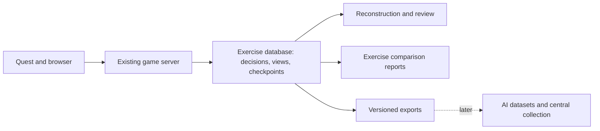

# Data capture implementation plan

**2026-09-16 · Owner approved phases 1–3; implemented and verified.** Durable capture, browser reconstruction, notes, exports and initial reports are running on the migrated local service. Browser interaction checks and an owner-confirmed Quest movement capture trial passed. See the [operating guide and verification record](../exercise-database.md) for evidence and remaining headset usability checks. The sections below preserve the approved planning baseline; phases 4–5 remain future proposals.

This turns the [data-capture research](data-capture.md) into a delivery plan for the current Pacific and CENTCOM workspaces. The recommended first release covers durable capture, reconstruction, and basic exercise comparisons. AI dataset exports and central hosting follow separately. No delivery date or hosting commitment is proposed.

## Recommended result

Give every exercise an archive that can answer: **who issued an order, what information was available, what they attempted, what happened, and which rules produced the result?** Add voluntary explanations and instructor assessments where useful. Use that same history for review and reports.

A facilitator would open an exercise, step through its turns and decisions, inspect the board before and after an order, see its costs and explanation, and read any linked notes. They could then compare compatible exercises and export the supporting records.

Reconstruction means the recorded game state and decision context. It does not initially reproduce headset motion, exact screen pixels, room layout, or conversations. “What the participant knew” must be presented more carefully as the information made available, with client-reported presentation evidence where captured; we cannot establish what a person noticed or understood.

## Pre-implementation baseline

Source inspection on 2026-09-16 establishes:

- [Map sessions](../../server/map-sessions.ts) maintain six independent exercises. Map switching preserves their state.
- [The session handler](../../server/scenario-session.ts) saves accepted commands and full resulting states to JSONL, validates replay on restart, and protects against duplicate/stale commands.
- [The rules](../../src/scenario/rules.ts) already pin content versions and preserve placement, movement, loading, unloading, hold and turn events.
- [The shared workspace](../../src/play/workspace.ts) submits browser and Quest orders through the same service. This is the capture integration point for both interfaces.
- Participant identity, decision timestamps, historical observation records, notes and cross-exercise analysis are missing. Current sessions expose shared full information. Competitive outcomes, fog of war and referee workflows are not implemented.

The new store can build on these foundations without replacing the terrain renderers or changing movement rules. The equipment catalog remains a separate database.

## Architecture

Use **one SQLite exercise database on the game server's local disk**, accessed only through the existing Node service. Keep six independent active-map pointers and any number of archived runs within it. Each new exercise gets a new run ID; switching maps or reconnecting resumes the existing run. Importing a save creates a new run with source lineage.

SQLite is my recommendation for the present single-server, 2–4 player pilot. Its official documentation supports application-server storage and describes its one-writer constraint; suitability for our workload is an engineering judgment to verify, not a measured capacity claim. Revisit a central transactional database, such as PostgreSQL, when multiple servers or write contention justify it. [SQLite, Appropriate Uses, §§1 “Server-side database” and 2 “High Concurrency”; accessed 2026-09-16](https://sqlite.org/whentouse.html).

Use Node's built-in SQLite API if the implementation checks pass. The active host has Node 26.0.0 and SQLite 3.53.3; an in-memory connection succeeded during this planning task. The project's declared minimum is Node 22.18.0, whose version-specific documentation includes `DatabaseSync` but marks the module experimental. Test the actual APIs on both supported runtimes before relying on them. No dependency installation is currently needed. [Node 22.18.0 SQLite, module status and `DatabaseSync`; accessed 2026-09-16](https://nodejs.org/download/release/v22.18.0/docs/api/sqlite.html).

## What we would store

| Record group | Content | Purpose |
| --- | --- | --- |
| Exercises and versions | Run/map IDs, scenario/rules/catalog/build versions, initial setup, learning objective when supplied, start/end status, parent run/checkpoint | Rebuild and compare the right exercise |
| Participants and sessions | Server-issued seat identity, role/team assignments, human or policy category, browser/Quest segments | Attribute orders and distinguish device changes from new participants |
| Decisions and effects | Command ID, actor, server times, turn, ordering, observation references, accepted/rejected result, stable reason codes, before/after references, resource and cargo changes | Reconstruct intent and execution without double-counting retries |
| Historical views and checkpoints | Versioned permitted board state and guidance, delivery/presentation status, compact state checkpoints | Review the information available at the decision and seek through the timeline |
| Notes and assessments | Optional intent/assumption, author and audience, assistance, reflection, rubric and assessment version | Discuss reasoning and learning separately from game outcomes |
| Quality and exports | Missing fields/ranges, telemetry loss, provenance, reuse policy, export filters and artifact hashes | Make reports and datasets traceable |

Use typed/indexed columns for common filters and versioned payloads for action-specific details. Likely tables are `runs`, `active_maps`, `participants`, `participations`, `command_results`, `events`, `observations`, `checkpoints`, and `annotations`; add export-job and dataset-manifest tables with those features. A small persistence module is sufficient; no new collection service or message broker is proposed.

Capture implemented mechanics immediately. Add event producers for combat, disclosures, contests, referee rulings, scoring and policy decisions when those features exist. Unavailable outcomes and unrecorded rationales stay unknown. Generated demonstration placements are labeled setup, and imported history is labeled inherited history.

## Delivery sequence

| Phase | Work | Reviewable result and acceptance evidence |
| --- | --- | --- |
| **1. Reliable capture and recovery** | Add schema migrations, stable run/seat IDs, historical views, transactional command storage, compact events, checkpoints, capture status and portable archive export. Migrate existing map journals with validation. | Two clients and a scripted fixture produce attributable orders. All six maps resume independently. Replaying every checkpoint reproduces its state. Retry, restart, storage failure, new/imported run and backup restoration tests pass. |
| **2. Exercise reconstruction** | Add an archive browser and decision timeline with before/after board, action, cost, explanation, historical view and optional notes. Add selected preview/cancel/restriction/help events through shared callbacks. | A facilitator reconstructs a chosen decision from its evidence. Earlier runs remain available after New exercise. Missing notes and lost telemetry are visible. Browser and real Quest capture paths are exercised separately. |
| **3. Trends and analysis** | Add a small browser report view and CSV exports for three defined metrics, with filters for compatible exercises and capture quality. | Known fixtures reconcile exactly to report counts; retries/imported history do not inflate results; incompatible versions and incomplete runs are separated. |
| **4. Controlled AI datasets** | Add reproducible dataset jobs with permitted historical observations, chosen actions, provenance, quality exclusions and fixed evaluation splits. | Every example traces to source evidence; unspecified training permission excludes a run; related imports/branches stay in the same split. Policy/tutor formats stay distinct. |
| **5. Central collection if needed** | Add retryable upload, central storage, operational access controls and larger analytics exports after measuring workload. | Delayed upload does not block locally durable play; ingestion deduplicates; restore and measured capacity checks pass. |

**Recommended first-release scope: phases 1–3.** Deliver each as a usable increment. The first demonstration is a short mixed-client exercise, a restart, reconstruction of one cargo decision, and a report comparing several labeled fixture runs. Headset interaction evidence and server/replay evidence remain separate.

The reconstruction and comparison interfaces would initially live in the browser, where timelines and tables are easier to use. Capture runs for browser and Quest from the first phase. This proposal does not require a new in-headset analytics interface.

## Three first reports

1. **Rule and interface friction:** unique rejected orders divided by unique submitted orders, grouped by stable reason; show displayed restrictions, cancelled previews and help use separately. Distinguish stale-state/network problems from rule restrictions.
2. **Resource and transport choices:** movement-budget use and remaining capacity by turn, cargo load/unload activity and carrier utilization. Show authored movement points as game units. A load/unload is not automatically a successful mission delivery.
3. **Participation and pacing:** orders by participant/team and interface, time from acknowledged exercise-ready to first accepted order, and decision intervals with recorded interruption coverage. Elapsed time is not inferred thinking time.

Every report carries raw counts, denominators, sample size, metric version, relevant scenario/rules/map versions, assistance conditions and missingness. Compare like exercises; do not treat many moves from one team as independent learners. Wins, decision speed and learning are different measures. Instructor-defined reasoning rubrics and transfer tasks can extend the reports later.

Use run-scoped participant pseudonyms by default. Longitudinal individual/team progress needs an explicit, separate cross-run linkage key; without that key, the first release supports exercise/cohort comparisons, not claims about a particular learner's improvement.

## Reliability and reconstruction details

The service first computes and validates a proposed transition. One database transaction then records its command result, events, essential view references, and new authoritative state. Only after commit does the service update its in-memory state and publish success. A storage failure leaves gameplay unchanged and returns a retryable storage error. A retry after a committed but unanswered request returns the original result reference alongside an appropriate current view.

Scope command identity to run and server-established participant. Preserve service revision, exercise revision, capture sequence and view revision separately. New/import operations atomically close the previous run, create the next run and change the active-map pointer, while keeping the initiating request identifiable for retry. Stale requests must never apply to the replacement run.

Store each compact event once. Checkpoints exclude the accumulated history array; reconstruct the existing save format when exporting or hydrating it. The current in-memory rules/API can retain their history representation initially, so this avoids repeated database history without promising to remove all in-memory or network growth. Pin the actual rule/content artifacts as well as hashes. Replay uses the matching version and verifies state hashes; future random resolution requires recorded draws and generator state.

Persist the actual versioned player payload or an exact reconstructable representation, including state references and rule guidance. Link both the view used to draft the order and the view/state used to validate it. Record server-issued, delivered and client-reported presented evidence distinctly. Start with today's explicit full-information view; future role filtering must govern live responses, replay, notes and exports consistently.

Keep optional interface events in bounded batches with deduplication and dropped-event counts. Their loss does not stop gameplay. Keep heavy report/export work off the command path. Define stable reason codes at the evaluator/session boundary instead of grouping human-readable error strings.

## Existing saves, backup and collection defaults

Migration reads frozen copies of old journals into a new database, segments new/import operations into runs, records input hashes, and compares replayed states and counts. Preserve originals; mark absent identity/time/view evidence `legacy-unknown`. Duplicate or overlapping imported history must retain lineage rather than count as new decisions. Quarantine incompatible inputs and report them explicitly.

Switch writers only after reconciliation, with the existing service stopped and one active database writer. Test cutover and rollback on synthetic copies first. After new orders enter the database, rollback must preserve them through a verified export/reconciliation path; reopening an old JSONL file alone would lose those orders. Avoid permanent independent writes to two stores.

Phase 1 includes a consistent backup and verified restore procedure with documented retention. Use a supported database backup mechanism or a clean shutdown copy, rather than copying an actively changing file blindly. SQLite documents its snapshot backup facilities separately from ordinary file copying. [SQLite Backup API, introduction and example; accessed 2026-09-16](https://sqlite.org/backup.html).

Proposed pilot defaults: minimal seat identity, exercise operation and review, optional short notes, and semantic interaction events. Raw audio/video, room imagery and continuous controller traces are outside this collection scope. No silent expansion of capture is proposed.

Define note audiences and reuse policy explicitly. Private or instructor-only notes require enforced server access checks before those options are offered; today's shared board does not supply that boundary. Real authentication/authorization accompanies remote or opposing-role deployment. Training exports require explicit permitted use. The host must set retention periods; deletion handling covers source records, derived exports and backup expiry. The plan does not assume permission to collect institutional rosters.

## Verification performed at proposal time

- Read the existing capture, architecture, learning and AI research and inspected current session/rules/workspace code. No active journal or participant data was read or migrated.
- Ran `node --test tests/scenario.test.ts tests/map-sessions.test.ts`: **13 tests passed**, including per-map persistence, replay, imports and duplicate/stale protection. These are existing-foundation checks, not tests of the proposed database.
- Confirmed Node 26.0.0 / SQLite 3.53.3 with an in-memory connection. File-backed durability, minimum-runtime execution, collection overhead and real Quest performance remain to be tested during implementation.
- This change adds a proposal and a link from the research document. No application code, dependencies, active exercise storage or hosting changed.

The owner subsequently approved the first release and asked for a functional database to learn from wargames. Current implementation, migration and verification evidence are recorded in the operating guide linked above.
