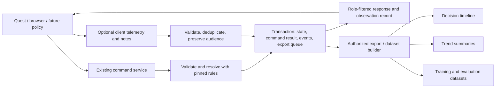

# Data capture: decisions, analysis, and future AI

**2026-09-16 · Proposed design on `codex/data-capture`.** The owner confirmed data capture as a major pillar for discovering trends, analysis, and future model training. This document audits the current application and recommends an implementation path. It does not introduce a collector, database migration, dashboard, or training pipeline.

## Recommendation

Build a **replayable decision record** into the existing authoritative session service. For each committed decision, preserve who acted, what information was available, what they attempted, what happened, and which rules produced that result. Link selected reflections and instructor assessments to those records. Derive reports and training datasets from this common history.

Start with the geographic tabletop and a local SQLite exercise database, then apply the same capture contract to Island Coordination. Keep the two games' rules and histories distinct. Use JSON/JSONL for portable exports and CSV for initial summaries. Add centralized storage and columnar analytics exports when actual exercise volume warrants them. These are recommendations, not approved hosting or technology commitments.

This makes three concrete experiences possible:

1. **A decision timeline:** replay a move with its original player view, resource cost, stated assumption, and later result.
2. **A trend report:** compare recurring restrictions, resource choices, assistance, and plan revisions across comparable exercises.
3. **A dataset builder:** export versioned, permitted examples for an opponent or tutor, with historical observations and separate evaluation sets.

The [AI Sensei study](../research/ai-sensei-and-wargaming-cloud.md#line-of-effort-3-data-analytics), [learning plan](../research/learning-and-adjudication.md#proposed-after-action-review), and [simulation blueprint](simulation-blueprint.md) already call for these foundations. The [CPE review](../research/command-professional-edition.md#8-analysis-and-customization-are-existing-strengths) describes existing analysis/export capabilities; our opportunity is to connect data to the learner's decision and teaching context. No commercial simulator access is needed.

## What the application already captures

**Observed from source on 2026-09-16:**

| Existing component | Useful foundation | Gap for analysis or training |
| --- | --- | --- |
| [Island session](../../server/session.ts) | Accepted command ID, expected revision, action and resulting state; flushed JSONL append before acknowledgment; retry protection | Startup restores stored snapshots and checks version strings, without replay-validating every journal transition. No participant/run identity or decision timestamps. |
| [Geographic session](../../server/scenario-session.ts) | Accepted action/new/import operations and snapshots; revision and duplicate checks; startup replays and compares each record | No actor, observation, rationale, rejected-attempt history, or stable run lineage. Service revision and exercise revision are different counters. |
| [Geographic rules and save](../../src/scenario/rules.ts) | Scenario, rules, catalog, equipment, profile, map/geography versions and source hashes; action explanations; exact save replay | No observation/action schema version, learning objective, assessment, policy identity, or human/bot distinction. Demo placements are generated history events, not human decisions. |
| [HTTP service](../../server/main.ts) | Both interfaces submit through the same command handlers | Shared full information, no authenticated participant/role boundary; SSE carries full snapshots. SSE is a delivery channel, not a historical event store. |
| [Island UI](../../src/main.ts), [geographic UI](../../src/scenario/main.ts) | Local previews/cancellation, explicit confirmation, browser exports, runtime diagnostics | Previews, hints, cancellations and XR lifecycle are not persisted as an analysis record. An export timestamp does not date the original decisions. |

Both journals live in gitignored `data/`. Each accepted record repeats the entire accumulated event array. **Inference from the representation:** the history portion grows quadratically over a long uninterrupted run. The current journal is valuable recovery material, but should not become the long-term analytics format unchanged.

**Synthetic check:** 100 `advance` commands against the default geographic demo produced 100 journal records totaling **1,370,146 bytes**. Record size rose from **4,300** to **23,118 bytes**; the final exercise contained 107 events including seven demo placements, while the journal repeated **5,750 event entries**. Reopening the temporary journal reproduced the final state exactly. This is a serialization fixture, not a classroom workload, throughput benchmark, or measured SQLite saving. The temporary journal was removed; no active exercise data was read or changed.

Earlier saves can supply verified mechanics history where their format supports replay. Missing actors, timestamps, observations and rationales must remain unknown. Never reconstruct a learner's intentions from an outcome or silently label generated demo actions as participant behavior.

## Capture contract

These are proposed logical records, not a requirement for one service per record type.

| Record | Minimum content | What it enables |
| --- | --- | --- |
| Run manifest | Unique run/session IDs; game, scenario and rules versions; build/content hashes; map/catalog references; initial checkpoint; capture/observation/action schemas; objective; practice/assessment mode; assistance conditions; end reason | Reproducibility and comparison of like exercises |
| Participation | Run-scoped participant pseudonym, team/role, assignment changes, human/script/search/learned-policy category, policy/checkpoint/configuration when applicable; client/interface segment | Human/bot separation and correct attribution when a learner switches devices or roles |
| Observation | Exact permitted payload or reconstructable checkpoint/deltas; observation ID and role revision; projection version; issued/delivered/presented status; permitted action guidance | What the player or policy could use at decision time |
| Command and resolution | Command ID; actor; observation used; expected and validated revisions; action; accepted/rejected status and stable reason code; applied rules; before/after references; effects and explanation | Intent versus execution, resource accounting, retries and restrictions |
| Decision note | Decision/order ID; brief intent, assumption, considered alternative or confidence; author; audience; creation time and whether before or after the result | Reasoning discussion without inferring unspoken thoughts |
| Assistance and intervention | Hint/rule reference, pause, report disclosure, contest/ruling, takeover; issuer; linked event; reason and visibility | How assistance and changed adjudication affected the exercise |
| Outcome and assessment | Game outcome, defined reward components, termination/truncation, instructor rubric/version and labels, learner reflection, later transfer-task results | Separate game success, model reward, and learning evidence |
| Capture quality and reuse | Missing ranges, dropped optional events, legacy/unknown fields, schema validity, export lineage, authorized uses and retention policy | Honest analysis denominators and reproducible dataset selection |

Capture the current deterministic rules as deterministic: randomness fields can be null. If randomness is introduced, retain algorithm/version, seed, stream state and actual resolution draws. A seed alone is insufficient for replay across changed code. Archive or resolve pinned rule/content artifacts; a hash without the corresponding artifact cannot rebuild an exercise.

### Identity, ordering and time

- A new exercise/reset gets a new `runId`; reconnect stays in the same run. Import/branch creates a new run linked to the source run/checkpoint and import artifact hash. A legacy save may have unknown parent identity. Imported history is lineage, not a second set of new human decisions.
- Use a stable `eventId` and a server-assigned sequence within a run. Keep capture sequence, service revision, exercise revision and role-view revision explicit. Hints and observations can produce records without advancing game state.
- Scope command deduplication to the run and server-established actor. Retrying the identical command returns its original result reference; a different payload with the same identity is a conflict. Count retries separately from unique decisions. A refreshed decision after rejection uses a new command ID.
- Store server receipt/commit wall time separately from client-reported time, client monotonic duration, and simulation turn/phase. The current geographic turn has **no duration in minutes**. Do not invent simulation seconds or use client clocks to order authoritative effects.
- Record both the observation used to form the command and the state/view used at validation. Delayed presentation can make these differ. A sent snapshot is not proof it was displayed, and displayed information is not proof a learner noticed it. Presentation acknowledgments remain client-reported evidence.

For the trusted local pilot, a server-issued participant token can distinguish seats without claiming verified personal identity. Persist reconnect identity and role assignments. Actual authentication/authorization must accompany future opposing roles or remote deployment; arbitrary client actor strings cannot establish authority.

### Three capture paths

**Essential game history:** run boundaries, accepted commands, resulting effects, participant assignments, necessary observations and interventions. Persist the state transition and its record together before acknowledging success. Do not sample these records.

**Learning annotations:** short voluntary prompts at selected decision points, structured plan/assumption updates, instructor tags and assessments. Offer “skip”; preserve missing responses as missing. A postgame explanation is marked retrospective. Private notes and team-shared notes have different audiences. The existing [reflection proposal](../research/learning-and-adjudication.md#proposed-planning-reflection-tools) is a useful starting point.

**Optional interface telemetry:** preview opened/cancelled, restriction/help shown, input mode, immersive session start/end, disconnect/reconnect, and coarse performance summaries. These originate on clients, may arrive late or be lost, and cannot certify an official game result. Batch them with event IDs, bounded queues and explicit dropped-event counts. Persist displayed restriction codes as well as server rejections: many invalid choices never reach the server.

Capture semantic events, not controller poses or every animation frame. Raw voice, video, passthrough imagery, room meshes and continuous movement traces are unnecessary for this first design. Broader sensing would need its own research question and collection design.

## Storage options and proposed flow

| Option | Strength | Tradeoff | Recommendation |
| --- | --- | --- | --- |
| Extend the existing JSONL journals | Small initial change; easy inspection; useful legacy source | Manual indexing, cross-record integrity, recovery and export management; current snapshots duplicate history | Preserve as input; viable short spike, but avoid a separate best-effort analytics log that can diverge from game state |
| SQLite in the existing Node service | Local transactions and queries; no separate database service | One writer at a time; storage and query latency still need testing | **First implementation candidate** for the 2–4 player prototype |
| Central transactional database plus object storage | Shared collection across session servers and managed dataset artifacts | Hosting, tenant isolation, access, backups, operations and cost | Later candidate, such as PostgreSQL plus object storage, once measured needs justify it |

SQLite documents local/server application use and its single-writer constraint; many concurrent writers or multiple database hosts favor a client/server database. The proposed fit here is our inference from the current one-process workload, not a capacity guarantee. [DC01](../research/sources.md#dc01)



Proposed tables: `runs`, `participants`, `command_results`, `events`, `observations`, `checkpoints`, `annotations`, `export_jobs`, and `dataset_manifests`. Keep frequent filter fields typed/indexed, with versioned payloads for game-specific details. Use foreign keys and uniqueness constraints for references, event ordering and command deduplication. Keep the exercise database separate from the equipment catalog's existing `catalog/equipment.sqlite`.

The core write transaction should insert the command result, linked events and required observation references, update the authoritative state/revision, and enqueue any requested downstream export. Publish state after commit. The queued export can retry by ID after restart without duplicating rows. This transaction boundary is our design; SQLite's atomic-commit documentation supports the underlying all-or-none behavior, subject to its storage assumptions. [DC02](../research/sources.md#dc02)

Store compact events once and checkpoint state without embedding the entire prior history at every step. Begin with checkpoints at run start/end and selected turn boundaries; choose the interval after measuring replay and disk costs. Keep a schema migration path and explicit replay compatibility checks. Ordinary corrections append a linked correction; they do not erase the original result.

**Failure behavior:** failure to commit essential history leaves state unchanged and reports a retryable storage failure, rather than a rule violation. A crash after commit but before the response is recovered using the stored command result. Downstream analytics outages queue work and allow locally durable play to continue. Optional telemetry loss marks capture quality and does not stop play. Record bounded rejection metadata with structured reasons; never dump arbitrary malformed request bodies into the dataset. Test disk-full, interrupted writes, queue limits and recovery explicitly. Backups need a verified restore procedure; append-only application behavior is not a backup or tamper-proof archive.

The active host's **Node v26.0.0** successfully imported `node:sqlite`, reported **SQLite 3.53.3**, and rolled back a synthetic insert in memory. No new dependency was installed. Node documents `DatabaseSync` as synchronous; keep initial writes short and move heavy export/analysis off the request path. The project's declared Node minimum is 22.18.0; driver/API compatibility on that minimum and file-backed durability remain untested. [DC03](../research/sources.md#dc03)

## A concrete decision example

Suppose a player previews loading a piece, submits the order, and later explains why that transport was selected. The proposed internal result record could look like this. IDs and timestamps below are **illustrative**, and referenced artifacts are omitted for brevity; this is not an implemented schema or an actual player record.

```json
{
  "schemaVersion": "xriegsspiel-capture/1",
  "eventId": "event-demo-42",
  "runId": "run-demo-01",
  "sequence": 42,
  "type": "command.resolved",
  "recordedAt": "2026-09-16T14:00:00.000Z",
  "actor": { "participantId": "seat-2", "kind": "human", "roleId": "cooperative" },
  "commandId": "command-demo-18",
  "decisionObservationId": "observation-demo-17",
  "validationObservationId": "observation-demo-17",
  "time": { "turn": 3, "phase": null, "simulationSeconds": null },
  "state": { "beforeRef": "state-demo-17", "afterRef": "state-demo-18" },
  "action": { "type": "load", "pieceId": "cargo-1", "carrierId": "transport-1" },
  "result": { "status": "accepted", "rulesVersion": "geographic-movement/0.1.0" },
  "audience": "exercise-control",
  "captureSource": "session-authority"
}
```

The observation contains the actual permitted board/resources and guidance. The result references the resource and cargo changes; an optional note separately links to the decision with its own audience. Browser and Quest orders share this structure. A later bot uses the same action boundary, plus policy version/configuration. Neither an `audience` string nor a pseudonym alone enforces access control.

## Turn records into useful analysis

Define each metric and denominator before comparing sessions. Suggested first reports:

| Question | Proposed measure | Interpretation limit |
| --- | --- | --- |
| Which rules cause friction? | Displayed restriction counts by rule/code; unique rejected commands / unique submitted commands; help use | Show telemetry coverage and retries separately. Offline lookups require observation/self-report; no captured hint does not prove no help occurred. |
| How do teams allocate resources? | Available/used capacity by turn, delivery order, unmet objectives at checkpoints, plan changes after reports | Compare compatible rule/map/objective versions. Current abstract movement points are not travel time or vehicle performance. |
| Do teams adapt? | Changes to recorded assumptions/plans after an information disclosure; instructor assessment of the rationale | An action change alone does not show a better plan; absent notes cannot be inferred. |
| Is the interface getting easier? | Time from acknowledged scenario-ready to first accepted order; disconnect/pause segments; cancellations; support requests | Report elapsed and available active-time measures separately, with device/experience conditions. Speed is not learning. |
| Is learning improving? | Rubric-scored reasoning before/after an equivalent task and transfer to a changed vignette | Requires an explicit teaching study. A small trial or better win rate is not an efficacy result. |

Every report should carry scenario family/version, experience category when collected, team size, opponent version/difficulty, assistance mode, interface segments, sample size, missingness and metric version. Give raw counts alongside rates. Stratify comparable groups before aggregating; preserve team/run clustering and avoid treating thousands of moves from one team as thousands of independent learners. These are proposed analysis controls informed by the existing [education review](../research/dataset-review.md), not a validated assessment instrument.

## Prepare AI datasets deliberately

Use a reproducible export job, not a raw journal upload. Each dataset needs a manifest: source run/event IDs, content/schema versions, extraction code version, filters and exclusions, permitted purpose, labeling/rubric provenance, split assignment, quality report and artifact hashes. Preserve links from derived examples back to the evidence.

| Intended use | Example derived record | Essential distinction |
| --- | --- | --- |
| Imitation policy | Historical observation, available action guidance/mask, chosen action, human/policy category, assistance and label | Wins do not make every move an expert demonstration; instructor/expert labels require explicit provenance |
| Reinforcement learning / offline RL | Observation, action, reward components/version, next observation, elapsed game steps, terminal versus truncated status, behavior-policy metadata | Current geographic assembly/movement has no competitive reward or outcome. Define and validate those before calling its traces RL episodes |
| Tutor or explanation model | Permitted decision context, cited rule/event IDs, instructor-reviewed explanation or reflection prompt | A recorded rationale is a participant statement; a generated explanation is a model output. Neither is hidden human reasoning or an authoritative ruling |
| Search or policy evaluation | Pinned starting checkpoint, observation policy, opponent/configuration, computation budget, outcomes across variants | Search branches and synthetic play remain labeled synthetic and linked to their parent run |

Preserve observation-action-next-observation timing, including other actors' intervening events and delayed resolutions. Log policy checkpoint, action selection settings and any probabilities only when actually supplied; do not manufacture propensities later.

Keep full game truth in a restricted internal record and export only the intended policy's historical information. Hidden state, later disclosures, opposing sealed orders, referee-only notes and postgame outcomes must not enter the model's decision inputs. Rewards/labels can be separate privileged targets if the experiment explicitly allows that. Historical projection must use the original rules/view version; today's visibility logic is not proof of yesterday's information.

Split by participant/team, scenario family and shared run/branch ancestry before fitting or tuning. Keep imported copies and near-duplicate branches in the same split. A cross-session participant linkage key is separate, purpose-limited data; without it, report that participant-independent evaluation cannot be established. Reserve unseen scenario families for transfer tests and avoid tuning on the test set. Record exclusions for broken replay, missing observations, uncertain permissions or incomplete capture.

## Access, retention and portability

Make reuse explicit in the run policy: operating the exercise, instructor review, aggregate research and model training are distinct purposes. Unspecified training permission means exclude from training export. Use run-scoped pseudonyms by default, keep any roster mapping separately restricted, and retain note audiences through exports. Pseudonymous records are not necessarily anonymous. The eventual host must set retention periods and any cross-organization arrangements; this proposal assumes no access to institutional participant records.

Normal gameplay corrections preserve history. Retention expiry or authorized deletion is a separate controlled operation covering source records, identifying notes, export caches, backups under their retention policy and dataset manifests. Keep a minimal nonidentifying deletion audit where appropriate. Already distributed datasets and trained checkpoints need explicit withdrawal/rebuild handling; deleting the original row cannot promise that a trained model has forgotten it. This is an engineering lifecycle proposal, not a statement of legal requirements.

First exports should be a manifest plus JSONL events/observations and CSV summaries, with audience filtering performed on the server. Keep full-fidelity internal and role-filtered exports distinct. Later, Parquet is a candidate for larger derived tables because it is a column-oriented format with compression and analytics support; compatibility must be checked for the chosen writer/readers. It is not the live command journal. [DC04](../research/sources.md#dc04)

If an instructor's learning system needs interoperability, add an **xAPI adapter** for selected milestones such as exercise completion or assessed reflection. ADL describes xAPI as learner-activity interoperability; its repository points from historical 1.0.3 to current 2.0. Choose a supported version/profile with the receiving system before implementation. Preserve the richer game record independently; no LMS integration is required to begin capture. [DC05](../research/sources.md#dc05)

## Smallest useful implementation sequence

| Increment | Concrete change | Acceptance evidence to collect |
| --- | --- | --- |
| 1. Durable run and decision capture | Extend the geographic session boundary; introduce run/participant IDs, manifests, compact events, exact full-information observation references and transactional command results. Provide a capture-health indicator and export. | Two clients and a scripted command fixture produce attributable records; replay matches; duplicate/reconnect/crash cases retain one result; a new/imported run has correct lineage |
| 2. Decision review and low-friction notes | Timeline showing decision view, action, effects and selected reflections; structured assistance/restriction events | An instructor can reconstruct one decision without hidden context or invented rationale; optional telemetry loss is visible; browser/Quest input paths are exercised separately |
| 3. Comparable-session reports | Versioned extraction and CSV/SQL summaries for the first three useful metrics | Fixture counts reconcile to unique commands/events; missingness and assistance are explicit; incompatible runs are excluded or separated |
| 4. Controlled dataset export | Dataset manifests, split assignment, provenance, purpose/audience checks and quality validation | Every example resolves to evidence; unknown permission is excluded; no shared branch crosses splits; secret-variation tests pass once fog of war exists |
| 5. Central collection when needed | Retryable export queue, central store, backups and operational access controls | Delayed upload does not interrupt durable play; deduplicated ingestion, restore/deletion drills and measured workload capacity |

Start edits in [the geographic session handler](../../server/scenario-session.ts) and [HTTP service](../../server/main.ts), preserving pure rules in [the rules module](../../src/scenario/rules.ts). Add a small persistence module only as needed to share transaction/replay behavior. Browser and Quest capture should attach to common command/preview callbacks, rather than separate trackers in each renderer. Bring Island Coordination under the contract after the first end-to-end example works.

Migrate legacy journals through a read-only import into a new store, preserving the originals. Record input hashes and migration version; verify state/replay where possible; quarantine corrupt or incompatible runs instead of silently repairing them. Use `legacy-unknown` attribution for missing fields. Reconcile counts and final state before switching the active writer. Avoid independent writes to old and new stores as a permanent architecture.

Before expanding collection, also verify permissions on live responses, history and exports; role changes; rejected/malformed/stale commands; delayed observation acknowledgment; simulator/build changes; storage failure; backup restore; and deletion propagation. These are future acceptance checks, not tests that this research branch added or passed. Real Quest overhead, educational validity and multi-session capacity remain unmeasured.

## Verification of this proposal

- Reviewed the existing research and actual session, transport, UI, rules and save code; no active journal or participant dataset was accessed.
- Ran the synthetic 100-command journal/restart check described above and an in-memory SQLite import/rollback smoke check on the active host.
- Ran `npm test`: **37 tests passed**, including existing durability, duplicate/stale handling and geographic replay/import checks. These validate the current foundation, not the proposed collector.
- No application code, dependencies, active storage, hosting, AI model or headset configuration changed. This branch delivers the design and its supporting evidence; implementation remains the next step.
