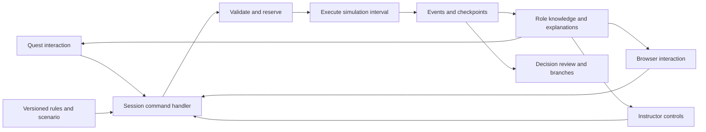

# XRiegsspiel: original simulation blueprint

**Status: proposed design, 2026-09-15. No application or API has been implemented.** This translates the [CPE reference study](../research/command-professional-edition.md) into our own platform. The [owner requirements](../product-requirements.md) are confirmed; stack, scenario, and detailed rules below are proposals.

## Product objective

An officer or student should be able to select a force, understand its options, contribute to a team plan, see what that plan costs, and learn from its execution. Software handles the records and ordinary adjudication. Participants retain decisions; instructors can resolve contested or unmodeled situations.

The first deliverable should demonstrate that full loop. It need not reproduce Command's equipment catalog or engineering models to teach useful operational tradeoffs.

## One original demonstration

Extend the existing **Island Coordination** sketch: a fictional team has limited transport and supplies to support two locations. An opposing team acts within the same authored rules. A new report changes one assumption; an instructor later adjudicates one disputed outcome. Human decisions drive the opposition initially.

Proposed student journey:

1. Receive the briefing, team role, objective, and initial reports.
2. Select a transport. See what can be reached in the displayed time window, its available capacity, and any existing assignment.
3. Choose a delivery task, route, destination, and cargo. Preview the arrival estimate and resources remaining for other requests.
4. Share the draft with the team. A designated order owner resolves an allocation conflict and commits it.
5. Watch the execution interval. See reports arrive and resource records update with their causes.
6. At the next decision opportunity, revise the plan using the new information.
7. Contest a specific result; the referee upholds it or records a supported correction.
8. Review the decision using what the team knew at the time, then discuss an alternative.

This is a learning vignette, not a real force plan. Scenario values should be explicitly authored game parameters. The brief should name the tradeoff being assessed and distinguish scenario success from quality of reasoning.

## Execution architecture

Use one authoritative session process initially, with a simulation module, durable event journal, and per-role information views. Quest and browser clients translate interactions into the same commands. This extends the existing [architecture recommendation](../research/architecture-options.md); it does not settle WebXR versus native Unity.



Persist a command's accepted result and its effects atomically before acknowledging it. Simulation processing and client rendering have separate clocks. A headset animation is never the authority for a movement, inventory change, or outcome.

### Headless execution and agent access

The owner's three lines of effort and AI Sensei vision motivate an early interface that can run the same rules without graphics. Implement a small headless runner alongside the authoritative loop; begin with a scripted policy as a verification fixture. Quest, browser, and policy clients use the same role-filtered observations and validated commands. An agent does not gain referee knowledge or bypass team order ownership.

Keep episode reset/advance/checkpoint controls privileged. In simultaneous planning, seal each side's orders until the commitment boundary. Log the observation revision, accepted command, policy/human category, outcome, and any referee intervention so later analysis can reconstruct the actual decision context. The [AI Sensei study](../research/ai-sensei-and-wargaming-cloud.md) specifies the proposed interface and data record, with separate opponent, teammate, tutor, referee, and analyst roles.

This is a foundation for later learning experiments, not a requirement to train RL models or deploy a large cloud in the first prototype. A tutor should initially explain versioned rules and recorded events; automated teaching feedback does not replace human adjudication.

### Domain objects

These are proposed concepts, not a requirement to create one service or database table per row.

| Object | Essential content and purpose |
| --- | --- |
| Scenario package | Learning objective, map definition, initial state, roles, original rules, content provenance, ending conditions, model/version manifest |
| Exercise run | Run ID, parent checkpoint if any, phase, simulation clock, ordered events, pinned configuration |
| Side and role | Information audience, controllable forces, order authority, instructor/observer privileges |
| Force | Stable identity, composition, position or carrier, capability state, resources, assigned tasks, communications state |
| Task/order | Issuer, owner, intent, assigned force, parameters, time constraints, dependencies, policy, lifecycle |
| Observation/contact | Report identity, recipient, observed time, received time, location estimate/uncertainty, confidence/category, expiry policy |
| Resource account | Resource type, units, holder, on-hand amount, reservations, capacity, transaction history |
| Rule/model | Version, allowed inputs, known limits, validation examples, explanation templates |
| Adjudication/contest | Result ID, inputs, rule/model version, draw if used, permitted explanation, referee decision and affected history |
| Decision note | Intent, assumptions, alternatives, author, visibility, linked order/result |

Keep a force's embarked state explicit: it is located in a carrier or on the map, never both. Distinguish functional capability from personnel/strength and inventory. A damaged transport may still exist but be unable to fulfill a task.

### Orders, missions, and policy

Start with a few typed tasks such as move, observe, deliver, hold, and the first scenario's bounded engagement action. A mission groups tasks toward an objective; it should not require students to manipulate a programming graph.

Use explicit lifecycle states: **draft → submitted → accepted → executing → completed**, with rejected, blocked, and cancelled alternatives. A pending dependency is a reason for waiting. Completion is evaluated against a defined condition. Reaching a priority threshold does not itself complete a task.

Policy inheritance can use scenario default → team/formation → mission → explicit unit override. The first implementation may support fewer levels, but must show the effective value and its source. Validate incompatible overrides at authoring time. Define which player roles may change them.

For shared forces, use a designated order owner with teammate proposals and visible revisions. The service must reject conflicting commitments or require an explicit replacement; do not silently apply the latest arriving order. This role system is an interface proposal, not a claim to model an entire real command hierarchy.

## Time and rules

**Recommended first cadence: paused team planning with simultaneous execution over a bounded interval (WEGO).** It provides discussion time and a natural referee checkpoint. Exact interval lengths and phase names belong to the scenario. Optional ready timers measure wall time; movement and supply use simulation time.

A proposed loop is planning → commitment → referee check if needed → execution → result review → next planning opportunity. This is not a universal military planning process or an approved sequence for every game.

For the initial model, use a small authored map with traversable connections and explicit travel times/costs. A spatial table can render that map without simulating the whole globe. Reach means “destinations attainable within this displayed interval under these assumptions.” Keep later geospatial/continuous navigation behind the same task interface.

During an interval, process scheduled events in a defined order. Rules must specify ties, simultaneous interactions, interruptions, cancellation effects, and which orders persist into the next interval. Use integer simulation time and declared quantity units. Do not let network arrival order decide an in-game simultaneous contest.

A turn-based action budget and a continuous endurance estimate are different models. Do not combine them into one universal movement radius. Implement the selected cadence first; support other rules through explicit rule packages later.

## Action guidance as part of the rules

The evaluator should serve both previews and commitment validation. Use structured reasons so UI wording cannot drift from implemented rules.

Proposed interface shape:

```text
evaluateAction(roleView, candidate, context)
  -> viewRevision, rulesVersion, actionStatus
     knownRequirements[], permittedReasons[], ruleReferences[]
     reachableGeometry?, estimatedDuration?, costAndReservations[]
     assumptions[], informationLimits[], conflictingOrders[]

submitOrder(authenticatedActor, commandId, expectedViewRevision, candidate)
  -> accepted order ID | rejected with permitted reasons | refresh required
```

An action can be allowed, blocked by a known rule, or allowed with unresolved conditions. For example, a route may be feasible using known information while execution can still discover an obstacle. Previews must not query secret state in ways that reveal that obstacle, even indirectly through cost or latency.

The server validates ownership and authoritative constraints at the correct execution point. A rejection must not reveal hidden entity IDs, enemy orders, or secret causal details. Use role-visible revisions for refresh checks; internally retain a global event sequence without exposing activity on other sides through revision counters.

### Example of the selection experience

For a fictional transport with ten abstract load slots, show: **10 total; 6 reserved for Delivery A; 4 available.** When Delivery B asks for five, explain that it exceeds the unreserved capacity by one. The user can reduce the request, propose replacing the existing assignment, or choose another eligible transport.

The preview should identify whether a number is inventory, capacity, reservation, or an estimate. The map and task panel should agree. Selecting an opponent contact should show a report, not the hidden force record.

## Resources and sustainment

Use explicit transactions for loaded, unloaded, consumed, lost, restored, and referee-adjusted resources. A draft consumes nothing. An accepted order may reserve resources; execution consumes or transfers them at a defined point. Cancellation releases only the unused reservation and does not reverse completed consumption.

For conserved resources, verify **starting balance + receipts − consumption − transfers out − losses = current balance**. Log transfers at both ends in one transaction. Prevent negative balances and duplicate spending after retries. Capacity constraints are separate from inventories and may require simultaneous checks of mass, space, seats, and compatibility in later models.

A supply task should expose source, destination, available stock, carrier, travel/handling time, and the receiving force's unmet need. A resource arriving at a location does not automatically mean every force there is ready. Implement a named service/repair/readiness rule only when that relationship is part of the scenario.

Start with a small number of resources whose effects students can explain. Keep broader personnel, medical, maintenance, and transport-network models as staged expansions with their own validation examples.

## Information and communication

Maintain world state separately from each side's knowledge. Only permitted observations update the client view. Record observation time and report receipt time independently; a delayed report can describe an old location accurately while being stale now.

Provide team annotations, requests, acknowledgments, and brief decision notes linked to tasks. Decide their audience when created. A proposed later simulated communications model can delay or prevent delivery of in-game reports and orders while forces continue under standing policy.

Transport connectivity is separate: loss of Wi-Fi should show connection status and follow the session's reconnect policy, not silently become an in-game communications event. On reconnect, send an authorized snapshot plus subsequent visible events. A real network retry must not issue a second order.

Ordinary observer roles should have explicit audiences. Reserve a full-information view for instructor-authorized control/review. Filter logs, exports, explanations, AI inputs, and replay with the same visibility rules as the live map.

## Referee control and explainable outcomes

Create an outcome record with the initiating order, applied rule/version, inputs, effects, and explanation. Randomness, if needed, uses recorded draws. A learner sees the authorized explanation; the referee can inspect fuller evidence.

Proposed first correction policy:

1. A contest points to an outcome and includes the participant's reason.
2. Freeze further commitments at the result-review checkpoint while the referee resolves it.
3. The referee can uphold it or apply one of the supported typed corrections, with reason and disclosure policy.
4. Apply the correction atomically, validate resources and affected tasks, append the ruling, and refresh both clients.
5. If later resolved events depend on the disputed result, preserve that run and create a branch from the earlier checkpoint. Show which orders require review/resubmission.

Do not implement unrestricted editing of arbitrary state first. Start with a meaningful supported case such as correcting an abstract loss or resource balance. Every correction must maintain invariants and explain its consequences. A ruling is an instructor decision, not retroactive evidence that the engine originally produced that result.

Information already revealed cannot be taken back from participants. A branch after disclosure is a teaching alternative, not an uncontaminated replay of the original decision. Record that disclosure in the review.

## Models and repeatability

The first rules can be deterministic while incomplete information and a human opponent create uncertainty. Add probability only where needed for the learning task. Deterministic execution with recorded random draws still supports stochastic models; the two concepts are compatible.

Keep movement, observation, effects, resources, and task scheduling as separate functions within one codebase. Each model needs a small specification: purpose, inputs, units, output, assumptions, unsupported cases, and worked examples. Model complexity should be justified by a learning requirement, not visual realism.

A checkpoint contains canonical state, pending events, knowledge state, model versions, and randomness state. Journal accepted events and resolved outcomes. Historical playback consumes recorded events; a fresh run evaluates the rules again. Save branches with a new run ID and a link to their starting checkpoint.

Later repeated-run analysis should vary stated assumptions, preserve each run's manifest, and show distributions and sensitivity. A favorable simulated outcome does not establish real-world effectiveness. Parallelize independent runs before complicating the first session's event ordering.

## Quest and browser interaction

Use the existing [Quest research](../research/quest3-development.md) for platform constraints. This product design proposes:

- A seated table with local placement, scale, and reset. Moving the table never moves simulation entities.
- A selected-force panel near the map, with concise options and expandable explanations. Keep long tables and bulk authoring convenient on desktop.
- Controller ray selection and browser pointer controls for every essential action; optional hand input uses the same command path.
- Task routes, report uncertainty, and resource flow shown only when useful to the current selection. Give overlays legends and labels; avoid relying on color alone.
- A timeline showing draft versus committed plans, pending dependencies, and important changes. Retain expert shortcuts without forcing newcomers to learn them first.
- A later, bounded ground-level observation experiment if a learning need justifies it. The confirmed first experience is the tabletop. Richer rendering must not expose hidden contacts or falsely imply that decorative terrain controls the model.

Stream role-filtered state changes and render locally. Decouple simulation advancement, network update frequency, and headset frame rate. Record target-device measurements before choosing update rates, text scale, or scene density. Reuse the same semantics across clients, not a desktop window arrangement inside a headset.

## Implementation sequence

These increments elaborate the [prototype checkpoints](../research/prototype-plan.md), not a new schedule commitment.

| Increment | Concrete result | Completion evidence |
| --- | --- | --- |
| 1. Rules and a selected-piece slice | One original map, a few forces, one resource model; select/preview/commit on browser and Quest | A user identifies reach, allowed actions, and costs without a manual; target headset tested |
| 2. Team execution | Authoritative orders, ownership, reservations, one WEGO loop, limited information; headless runner using the same engine | Two sides complete a short session; conflict, duplicate request, and reconnect handled; scripted and interactive runs agree |
| 3. Instruction and review | One contest/correction path, checkpoint history, decision notes, historical perspectives | Referee resolves a dispute; both clients converge; learner explains a changed decision |
| 4. Operational depth | Mission dependencies, additional sustainment/readiness, authored opposition and scenario editing | New features produce meaningful tradeoffs in an instructor-reviewed vignette |
| 5. Broader simulation | More domains/models, richer geography, optional real-time mode and repeated-run analysis | Each addition has documented assumptions and focused validation |

Choose WebXR/IWSDK or Unity after the existing small delivery comparison. A first web implementation could use a TypeScript session process and shared schemas; that is a candidate, not an installed dependency or settled stack. CPE access is unnecessary for every increment.

## Verification and evidence of improvement

**Engineering acceptance examples, not passing tests:**

| Check | Expected evidence |
| --- | --- |
| Conflicting team orders | One clear accepted commitment; other request receives a conflict with no silent replacement |
| Resource accounting | Reservation/commit/cancel/transfer/retry sequence reconciles; no negative inventory or double delivery |
| Hidden information | Two states differing only in hidden facts produce equivalent authorized planning views until disclosure |
| Timing | Pausing/freezing the client does not change simulation rules; interval boundaries and ties resolve consistently |
| Replay | Recorded events reproduce the checkpoint/final-state hashes and each role's historical knowledge |
| Referee correction | Original result retained; correction logged; dependent tasks invalidated or handled in a branch |
| Cross-client parity | Quest and browser issue the same command and receive equivalent allowed state |
| Agent parity | Headless and interactive runs agree for identical manifests and accepted orders; policies receive only their role's information |
| VR usability | Seated selection, cancellation, reset, text reading, headset removal and reentry work on Quest 3 |

**Proposed evaluation:** compare the same original scenario with contextual assistance enabled and a basic rules-reference interface, using equivalent variants and counterbalanced order. Separately compare Quest and browser with equivalent assistance. This distinguishes the value of guided rules from the value of VR.

Measure rule lookups, time to first valid order, bookkeeping corrections, assistance requests, order conflicts, comfort, and the instructor's reasoning rubric. Check learning with a changed vignette. Candidate improvement targets can be set after a baseline trial; none has been measured yet. Use the existing [learning plan](../research/learning-and-adjudication.md) to avoid treating faster interaction as proof of learning.

A future direct comparison with CPE would require an appropriately equipped evaluator and matched tasks. The owner has not requested obtaining that access. Until comparative evidence exists, describe XRiegsspiel's demonstrated outcomes and CPE's documented features separately.
