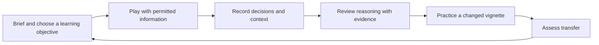

# Wargaming Cloud, game AI, and the AI Sensei

**Research and owner context: 2026-09-15. Status: design proposals; no agents, API, cloud service, or tutor implemented.** This extends the [CPE study](command-professional-edition.md) and [simulation blueprint](../design/simulation-blueprint.md). The owner wants our own improved platform, with Quest 3 primary and browser participation. The initial scope remains a 2–4 player tabletop.

## Why these notes matter

The owner identifies three institutional lines of effort: **agent development, agent integration, and data analytics**. Their combined purpose is an **AI Sensei** that helps learners develop their judgment as commanders. Preserve this as owner-reported strategic context; it does not establish an approved MCU/NPS program specification or an institutional partnership with XRiegsspiel.

Our proposed response is to make practice executable, decisions reviewable, and feedback useful. A strong opponent, a helpful teammate, and a good teacher require different evaluation. Winning a simulated game is one observation about performance under its rules; it is insufficient evidence of educational benefit or real-world command competence.

## Owner notes and public evidence

| Owner-reported context | What public sources establish | Consequence for XRiegsspiel |
| --- | --- | --- |
| MCU Wargaming Cloud is a digital game library accessible from any device/network | MCU lists games and personal-device access **outside MCEN**, the Marine Corps Enterprise Network. It does not establish universal device compatibility or Quest support. [W02](sources.md#w02) | Verify our browser/headset/network combination directly. |
| Capacity is 10,000 simultaneous users | No public technical capacity evidence was found in the sources reviewed. MCU's separate 1,000-player qualifier cap is an event participation limit, not a capacity measurement. [W02](sources.md#w02) | Retain 10,000 as a reported figure, pending its source and workload definition. |
| MCU Fight Club connects joint, allied, and partner participants globally | MCU describes Fight Club virtual qualifiers and joint/allied eligibility. This supports the participation model, not measured worldwide usage. [W02](sources.md#w02) | Plan for distributed teams and role permissions without assuming access to their participants or data. |
| HexWar is important to the ecosystem | MCU lists the HexWar / Code Wizards suite. The vendor separately describes an AI edition, reporting tools, and management system. [W02](sources.md#w02), [W41](sources.md#w41), [W42](sources.md#w42), [W43](sources.md#w43) | Study the specific product and edition; a suite listing does not prove every component is deployed. |
| CPE is the principal modern platform; NPS is improving its API and developing agents | MCU lists CPE. Public sources reviewed did not independently establish its primacy or that specific NPS development effort. [W02](sources.md#w02) | Preserve the owner report; do not invent the NPS API, endpoints, team, or delivery status. |
| Lack of APIs, headless execution, and third-party integration impedes agent development | CPE documents headless runs and integration. HexWar now advertises headless Company Commander AI with a Python/WebSocket interface. Exact deployment limitations remain unclear. [W31](sources.md#w31), [W41](sources.md#w41) | Clarify title, edition, build, deployment, and license before attributing the limitation. |
| Cloud agents use the optimal course of action for both sides | This specific deployment claim remains unverified. Published MCU qualifiers describe human opponents. [W02](sources.md#w02) | Do not equate a tournament, agent-training deployment, and all cloud sessions. Define what an agent optimizes. |

**Pending clarification:** whether “can't run headless” refers to the cloud's games generally, MCU's deployment, or CPE specifically. No answer has been recorded. This does not block designing our own engine.

### What the vendor descriptions add

**Company Commander AI:** HexWar describes external agents, a Python/WebSocket connection, and accelerated simulation without a graphical interface. Its order-selection system uses an Order Filter Graph and pathfinding. These are vendor descriptions, not a public protocol specification or a measured XRiegsspiel comparison. No API schema, runnable package, throughput benchmark, or MCU deployment was validated. [W41](sources.md#w41)

**Learning and administration:** HexWar labels its AAR and BAR tools beta; AAR concerns analysis after play and BAR supports annotations before play. Its management system describes users, teams, tournaments, and centralized data. These existing features matter when defining our improvement claims. [W42](sources.md#w42), [W43](sources.md#w43)

An API alone is therefore a weak differentiation claim. Our hypothesis is that one coherent experience can connect accessible rules, shared planning, credible opposition, referee control, and evidence-based teaching. Demonstrate that benefit rather than assuming current products lack these capabilities.

## AI includes several different methods

The following is a conceptual map for our design, not a dependency recommendation.

| Method | Plain explanation | Proposed use and limitation |
| --- | --- | --- |
| Authored rules or behavior trees | Follow explicit conditions and priorities | First predictable opponent and regression baseline; behavior is inspectable but limited to its authored cases. |
| Search, including Monte Carlo tree search (MCTS) | Explore possible future choices; use sampled continuations to direct more search toward promising branches | Compare bounded game choices. Hidden information, simultaneous actions, and a large action space require additional design. |
| Monte Carlo repeated runs | Repeat a specified experiment with sampled uncertainty | Estimate outcome distributions and sensitivity. Repeating a simulation is not automatically tree search, learning, or finding an optimum. |
| Imitation learning | Fit a policy to examples of decisions | Learn from appropriately licensed, contextualized demonstrations. Copies behavior, including its weaknesses; a winner's every move is not an expert label. |
| Reinforcement learning (RL) | Improve a policy through interactions and a defined reward | Later opposition research. Needs a reliable environment, substantial experimentation, and checks for exploiting model flaws. |
| Large language model (LLM) | Generate or interpret language from context | Optional explanations, briefings, and reflection prompts grounded in approved rules/events. Fluent text is not an authoritative simulation result. |

### The three examples in the owner's notes

- **AlphaGo (2016):** policy and value networks combined human-game supervised learning, self-play reinforcement learning, and Monte Carlo tree search. It was not MCTS alone. The useful lesson is the combination of learning with an executable environment and search. [A01](sources.md#a01)
- **OpenAI Five (2019):** a five-hero Dota 2 team trained through large-scale self-play using PPO, a reinforcement-learning algorithm. Copies of the learned policy controlled the heroes. It beat OG at the Finals under a restricted 17-hero pool; this was not five conversational LLM agents playing unrestricted Dota. [A02](sources.md#a02)
- **AlphaStar (October 2019):** initialized from human replays and improved through a reinforcement-learning league, reaching Grandmaster with all three StarCraft II races in 1v1 play. The league was a population used during training, not a five-player team inside a match. [A03](sources.md#a03)

These examples motivate an executable game interface and careful evaluation. They do not establish that their training cost, techniques, or playing strength will transfer directly to our educational wargame.

## Line of effort 1: agent development

**Proposed first deliverable: a small, documented game API and a headless runner using the same rules as human play.** Headless means the game advances without opening a graphical interface, browser, or headset. It must support repeatable episodes, not merely accept remote mouse clicks.

Keep five roles distinct:

| Role | Allowed responsibility |
| --- | --- |
| Opponent | Submit orders for its assigned side using that side's information. |
| Teammate | Fill an assigned team role; obey the same order ownership and conflict rules as people. |
| Tutor | Explain permitted information and ask teaching questions; issue no orders by default. |
| Referee | Inspect authorized evidence and resolve contests; retain the confirmed human takeover path. |
| Analyst | Study authorized historical runs; cannot silently change a live exercise. |

### Proposed interface contract

Names below are design notation, not existing endpoints:

| Operation | Required behavior |
| --- | --- |
| `startEpisode(manifest, seed)` | Privileged runner creates a run with pinned scenario, rules, observation/action schema, and policy versions. |
| `observe(role, revision)` | Return only that role's information, decision window, controllable entities, and permitted action guidance. |
| `submitOrders(role, revision, requestId, orders)` | Use human command validation, ownership, reservations, and duplicate protection. Return structured acceptance/rejection reasons. |
| `advanceToDecision()` | Privileged runner advances the authoritative rules to the next decision point; an ordinary client cannot advance another side's clock. |
| `checkpoint()` / `branch(checkpointId)` | Privileged experiment controls preserve state, knowledge, pending work, randomness, and parent-run lineage. |
| `exportRun(audience)` | Export role-filtered history or explicitly authorized research data with its manifest. |

For simultaneous planning, collect all sides' committed orders before resolution. Do not let the second agent see the first agent's sealed orders. An agent's action mask, error messages, previews, rewards, and timing metadata must not reveal hidden information. Unknown prerequisites should remain uncertain until the rules disclose their effects. Define timeouts, invalid-order handling, and a legal fallback so a stalled policy cannot freeze a session indefinitely.

Keep the simulation module usable in-process for fast tests; use the service API for network clients. A later ML wrapper may follow PettingZoo's parallel `reset`/`step` pattern for simultaneous actions and per-agent results. That pattern is not our authorization protocol or a ready-made implementation of WEGO. [A04](sources.md#a04)

**Acceptance evidence:** one scripted agent completes an episode; recorded human and bot commands obey identical rules; replay reproduces state; hidden-state variations do not alter an unauthorized observation; headless and interactive execution agree for the same manifest and accepted command sequence.

## Line of effort 2: agent integration

For XRiegsspiel, make the first adapter connect a policy to **our** engine. Commercial simulator adapters remain outside the requested build. Use one application codebase initially; separate components logically before introducing distributed services.

Later deployment should distinguish live sessions from batch experiments. A batch job may run faster than real time; it must not consume the capacity reserved for a classroom session. Keep simulation authority on the session process, rendering on clients, and agent evaluation on separately budgeted workers when measurements justify that separation.

Each executable policy needs a capability record: compatible rules/schema versions, controlled roles, observation permissions, resource budget, timeout behavior, policy version, and supported cadence. A future vendor integration would additionally require evidence of edition availability, headless execution rights, concurrent-instance licensing, hosting permissions, data export, and actual API compatibility. Public product pages settle none of those deployment details for MCU or XRiegsspiel.

### Interpreting the reported 10,000-user capacity

Measure these separately: registered accounts, connected clients, active human players, observers, simultaneous sessions, policy workers, and batch simulation steps per second.

An **illustration**, not a capacity claim: 10,000 active players in four-player games imply 2,500 sessions before observers or training jobs. Approximate state-update egress is connected recipients × average permitted update bytes × update frequency. Session CPU, agent inference, history writes, joins/reconnects, and network conditions require separate measurements. Quest frame rate is a client-rendering measure; it is not the server's player capacity.

Start with the confirmed 2–4 player session. Later load tests should report workload, hardware, sustained duration, tail latency, failure/recovery behavior, and cost. Decide capacity targets from those results and the intended deployment, rather than adopting an institution's reported number as our benchmark.

## Line of effort 3: data analytics

**Proposed first deliverable: an event history that can reconstruct a decision and the information available when it was made.** A large number of data points is not automatically a useful training dataset.

| Record | Why retain it |
| --- | --- |
| Run manifest | Scenario/rules/model versions, seed, cadence, objective, interface, and facilitator conditions make comparisons interpretable. |
| Decision context | Role, historical observation revision, known resources, permitted choices, selected order, and simulation time explain the available decision. |
| Process | Acceptance/rejection, execution events, resource changes, and information disclosures distinguish intent from what happened. |
| Human contribution | Optional short rationale at selected decisions; assumptions and revisions support discussion without making every move a writing task. |
| Intervention | Referee rulings, hints, pauses, and disclosures identify when assistance or modified rules affected play. |
| Outcome and assessment | Game result, reward definition, instructor rubric, and learner feedback remain separate fields. |
| Provenance and permissions | Human/bot identity category, policy version, dataset purpose, access audience, and retention/export rules govern reuse. |

Keep authoritative truth apart from player observations. Link both internally through event IDs, but produce exports appropriate to their audience. Do not provide a training policy a privileged field merely because the referee can see it. Record reward components separately from observation payloads; experiments using privileged training signals must identify them and evaluate execution using the intended player view.

Use only participant data available for the stated teaching/research purpose. Joint/allied participation does not imply permission to pool institutional records. Separate organizations and exercises, minimize personal identifiers, and define consent/access/retention with the eventual host. No such dataset is available in this repository. Raw voice/video recording is unnecessary for the first decision history.

For learning experiments, split data by participant/team and scenario family before fitting or tuning models; near-duplicate rounds should not straddle training and evaluation. Report scenario difficulty, assistance, opponent policy, and experience mix with cohort trends. More errors in a harder exercise do not by themselves demonstrate weaker learners. The existing [learning framework](learning-and-adjudication.md) provides the proposed assessment record. [D04](sources.md#d04)

## Putting the AI Sensei together

The first Sensei can be a structured teaching workflow with authored explanations. An LLM is optional. Build a rule knowledge source, a historical decision viewer, an instructor-approved rubric, and a small library of practice variations before an adaptive learner model.

During practice, the tutor might explain why a selected transport cannot accept more cargo, citing the rule and current reservation. After play, it could show the team's original assumption, when a new report arrived, and whether the plan changed. It should invite the learner to explain a tradeoff before presenting an instructor-reviewed alternative.

Separate **practice mode**, which allows selected hints, from **assessment mode**, which follows instructor-defined assistance limits. Every generated claim about game events should point to event IDs; rule explanations should cite versioned rule IDs. When evidence is missing, return an explicit limitation or refer the matter to the instructor. Generated feedback must not alter the referee record or impersonate a participant's unstated reasoning.

### What “optimal course of action” should mean here

A course of action is preferable only relative to a stated objective, model, information set, constraints, opponent assumptions, and computation budget. Opposing sides may have different objectives. A learned or searched policy does not become a proven equilibrium or universally best plan by winning many trials.

For teaching, compare alternatives and explain sensitivity: “Under these authored assumptions, this option preserved more of the shared resource in the sampled runs.” Keep estimated outcomes, uncertainty, and learner reasoning visible. Search over possible hidden states must use an explicit belief model, not privileged ground truth. A postgame omniscient branch must be labeled so it cannot be mistaken for advice available during the original decision.

### Recommended development sequence

| Stage | Build | Evidence before expanding |
| --- | --- | --- |
| 1. Instrument the small tabletop | Shared command semantics, headless execution, versioned events, role views | Human/browser/Quest and scripted-run parity; useful reconstruction of one decision. |
| 2. Establish practice baselines | Simple authored opponent; rule-linked help and review | Legal play, stable difficulty, fewer rule lookups; instructor checks feedback accuracy. |
| 3. Evaluate the teaching loop | Selected reflection prompts and a changed vignette | Separate usability, game outcomes, reasoning, and transfer; do not treat a small demo as an efficacy trial. |
| 4. Research learned policies | Imitation where suitable data exists; RL/search where justified | Held-out scenarios, both sides, multiple seeds/opponents, failure analysis, and resource cost versus the authored baseline. |
| 5. Expand deployment | Isolated organizations, managed policies, workload testing | Measured capacity and operating arrangements appropriate to the intended host. |

Tutor evaluation should include factual accuracy, hidden-information leaks, hint usefulness, instructor agreement, and transfer to a changed problem. Opponent evaluation should include legal-action rate, strength against several baselines, diversity, predictability, and failure recovery. Neither score can substitute for the other.

## Handoff limits

Public research confirms relevant product capabilities and historical AI methods, not installed access, cloud capacity, training data availability, or educational effectiveness. The reported NPS API work, CPE's institutional primacy, 10,000-user figure, and current agent deployment need an attributable source before being presented as externally verified facts. No contact, account access, simulator installation, model training, or runtime benchmark occurred.
