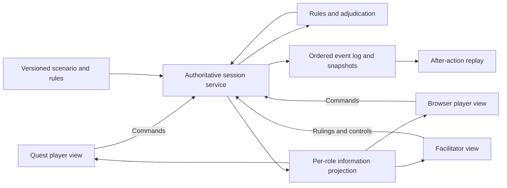

# Architecture options and initial recommendation

**Status: proposed, not accepted.** Research baseline: 2026-09-15. The owner's confirmed priorities include Quest 3 first, browser participation, operational team planning, hybrid adjudication, and reducing rule-lookup/bookkeeping burden. See [requirements](../product-requirements.md). The VR approach and stack remain open.

## Recommendation

Start with a **shared immersive tabletop**, a fully playable browser view, and a facilitator view. Evaluate a small first-person observation mode using the same scenario. For this scope, test **WebXR/IWSDK first** because it offers a direct web/Quest delivery path. Keep **Unity/OpenXR** as the native candidate if headset-specific features or richer first-person interaction prove central. The [Quest guide](quest3-development.md) documents the technical evidence.

Browser users should be able to play a side and issue the same valid orders as headset users. A browser-only referee dashboard is useful, but it would not by itself satisfy the owner's requirement to use the wargame through a browser.

This recommendation is based on development scope and the available project foundation. It is not a performance benchmark or a claim that either stack has already passed the prototype tests.

The owner clarified that CPE is a reference for building our own platform, not a simulator to access or integrate. The [CPE study](command-professional-edition.md) and [simulation blueprint](../design/simulation-blueprint.md) extend this architecture with original domain and execution proposals. The recommended first simulation cadence is WEGO; this remains a proposal alongside the open stack choice.

## Experience choices

| Approach | Educational opportunity | Main cost or uncertainty | Proposed test |
| --- | --- | --- | --- |
| Immersive tabletop | Shared spatial context, terrain scale, annotation, team discussion | Readability, reaching, crowded map | Select/inspect pieces, mark a location, issue an order seated |
| First-person environment | Viewpoint, communication, observation, task execution | Locomotion, scene detail, animation, embodied interaction | One bounded observation task and return to table |
| Hybrid | Compare map understanding with local perspective | More modes and transitions; possible loss of context | Same decision before and after a viewpoint change |

Neither tactical nor operational scope forces one of these choices. A tactical game can remain abstract and turn-based; operational participants may benefit from a limited local view without needing a full first-person simulation.

## Technology choices

| Option | Why consider it | What must be proven |
| --- | --- | --- |
| WebXR/IWSDK client + web service | Common web deployment and interaction code; current Meta web path | Quest frame time, optional features, lifecycle, deliberate desktop controls |
| Unity native client + browser client + common service | Existing native setup knowledge; direct Meta features | Two-client consistency, Android build, browser parity, integration effort |
| Unity + a third-party WebXR exporter | Potential reuse of some scene/code assets | Exporter compatibility, input parity, MR features, networking, payload size |
| Another rendering engine | Could suit a later specialized interaction need | A concrete advantage over the tested web/native candidates |

Meta's IWSDK architecture and Unity's documented WebXR export boundary support the first three distinctions. [Q04](sources.md#q04), [Q12](sources.md#q12)

Do not begin by implementing two complete clients. Use the native reference and one small web spike to settle the first product path, then concentrate on it.

## Common architecture, independent of renderer

The following is an original proposed design:

“Authoritative” means one service decides whether an order is valid and what state follows. Clients can preview a selection or proposed route, but cannot decide the official result independently.

For a small session this can be one process with in-memory state and simple durable storage. Microservices, an external message broker, and elaborate persistence are not initial requirements.

## Proposed domain boundaries

| Element | Owns | Does not own |
| --- | --- | --- |
| Scenario | Learning objective, roles, initial state, map, timings, ending conditions | Headset tracking positions |
| Rules | Legal actions, state transitions, costs, timing, resolution | UI controls and 3D meshes |
| Session service | Membership, authority, sequencing, persistence, accepted commands | Client-specific layout |
| Information projection | What this role may know at this time | The full model sent and merely hidden visually |
| Renderer/input | Present state, translate gestures/mouse to commands | Official game outcomes |
| Review | Replay events, historical perspectives, assessment annotations | Quietly rewriting the original session |

## Action guidance and referee contests

The rules layer should expose role-appropriate action evaluations: eligibility, movement/recipient previews, costs, remaining capacity, timing, and concise rule references. Revalidate on commitment against the current session revision. Keep secret state out of previews and explanations.

A player contest references a recorded result. Referee resolution preserves the original result and appends an explained ruling; recalculate affected orders and derived state. Define the pause/checkpoint policy for dependent actions before implementing corrections. The [manual review](manual-review.md) describes these proposed contracts and their reference examples.

## Commands and state

Proposed command envelope fields:

- `commandId`: unique request identifier for safe retry.
- `sessionId`, `actorId`, `roleId`: session and participant context; identity is established by the service, not trusted from arbitrary client text.
- `expectedViewRevision`, `turnId`, `phaseId`: detect stale or out-of-phase commands using the actor's permitted view. Keep the global event sequence internal to avoid revealing hidden-side activity.
- `type`, `payload`: a domain action such as submit order, commit phase, or facilitator ruling.
- Optional decision rationale; its visibility policy must be explicit.

The service validates authorization, phase, ownership, costs, and rule legality, then appends accepted events with a monotonically increasing sequence number. Repeated delivery of the same `commandId` must not spend resources twice. Rejected commands return a clear reason and the revision needed to refresh the view.

These fields describe a future contract; no API or schema has been implemented. Choose one backend language after the client direction and team skills are known. A TypeScript service fits a web-first prototype; the existing FastAPI knowledge could support a Python service if that is the team's stronger path. Share schemas and behavior, not assumptions that C# and TypeScript arithmetic will always agree.

## Fog of war is a data boundary

Keep at least three concepts distinct:

1. **True state:** all modeled entities and pending events, available to authorized control.
2. **Observed state:** a side's contacts, last-known positions, report times, and uncertainty.
3. **Presentation:** what the local player currently has selected or visible on screen.

If an enemy piece is absent from a player's knowledge, do not send its hidden location and simply disable its mesh. The same rule applies to tooltips, logs, selection rays, replay files, and any later AI assistant.

For reconnect, send a role-filtered snapshot and the relevant later events. For replay, store enough information to reconstruct each role's historical view, including information disclosures and facilitator changes.

## Time, randomness, and replay

Implement the selected first game's cadence and phase sequence. Keep that definition separate from rendering so another game can use different phases later. The platform must not impose the owner's example action list as a universal sequence. Do not implement every surveyed timing model in the first build.

Game time advances according to the rules and facilitator controls. Rendering continues at the device refresh rate. Network delay and a headset entering standby must not advance or duplicate a game turn accidentally.

Use an explicit rules version, scenario version, initial state, ordered accepted events, and recorded random draws where used. A random seed alone does not guarantee cross-version or cross-language replay. Test replay equivalence against the stored state. Branching for “what if” should create a new run derived from a checkpoint.

## Map and room coordinates

Use a canonical local map coordinate system with explicit units and a declared origin. A hex scenario can store axial coordinates; continuous terrain can use meters. Select one for the first scenario. Keep visual exaggeration of terrain height as presentation metadata, not a change to movement or visibility rules.

Map-to-room placement is local to each client. Rotating or scaling the virtual table changes the view, not unit locations in the simulation. Shared anchors can align colocated users later; remote users can each have a comfortable independent table placement. [Q15](sources.md#q15), [Q16](sources.md#q16)

Use simple original terrain first. Geospatial datasets, imagery, military symbology packages, and commercial counters need explicit source/usage records before import. No real-world order of battle or weapons-performance database is required for the proposed learning prototype.

## Decision gates

Select WebXR if the headset prototype meets the interaction/performance tests and essential features are available. Prefer the native path if a required feature demonstrably needs native APIs or the richer experience is materially easier to deliver there. Revisit export tools only with a small compatibility test that addresses an actual need.

Document the selected option and its measured evidence in a short decision record. Until then, the repository remains a research foundation.
