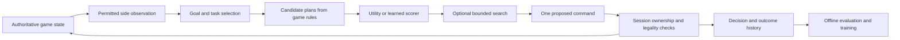

# Building an adjustable Red opponent

**Research and local checks: 2026-09-16. Branch: `oppoenent-research` (owner's requested spelling).** Recommendations below are proposals. The new executable deliverable is a feasibility probe, not a playable opponent or a trained model. It does not change the live exercise.

## Recommendation

Build our own **hybrid game opponent**: an authored behavior tree organizes goals, a utility scorer compares legal plans, and bounded search anticipates consequences and opposing replies. Start with three calibrated difficulty levels; add a fourth only when evaluation distinguishes it. Keep the same rules and information at every level.

The first training experiment should be **learning the plan scorer or a small policy/value network from game trajectories**, after a competitive exercise exists. A compact language model is a separate candidate for interpreting intent or ranking a short list of plans. Training a language model on the supplied manuals is not the missing step: those documents contain neither our game's legal actions nor labeled decisions and outcomes.

We do not need a new general AI algorithm or a foundation model trained from scratch. Our original contribution can be the game environment, objective-aware planning, difficulty calibration, decision record, and teaching workflow. Learning can improve replaceable parts of that system. The comparison with CPE and the distinction between an opponent, tutor and referee remain as recorded in the [AI Sensei study](ai-sensei-and-wargaming-cloud.md).

## What exists, and what is missing

**Observed in code at base commit `f25a7a7a02cd4fec40f427db1732da01ab94e829`:**

**Integration update, 2026-09-16:** Pacific and CENTCOM now host these geographic mechanics through independent [map sessions](../../server/map-sessions.ts) and a [shared workspace](../../src/play/workspace.ts). The Island trial and standalone Geographic UI are retired; references to those interfaces below describe the audited baseline. The probe still exercises the shared geographic rules/session directly in memory. The consolidation adds no competitive rules or opponent.

| Foundation | Actual implementation | Consequence |
| --- | --- | --- |
| Executable game model | [`src/pieces.ts`](../../src/pieces.ts), [`src/scenario/rules.ts`](../../src/scenario/rules.ts): deterministic movement, layered occupancy, cargo, costs, hold and budget refresh | A bot can use the real rules without a browser or headset. |
| Red/Blue equipment | 1,607 catalog definitions; seven-piece default geographic demonstration; six maps | Useful content and test fixtures. National labels and source specifications do not establish behavioral doctrine or combat strength. |
| Preview and transition | `GeographicRules.reachable`, `evaluate`, `apply` | Reuse legality and transitions; never ask a model to calculate whether an order is legal. |
| Persistence and replay | Version manifests, replay-checked import/export, command IDs and revisions in [`server/scenario-session.ts`](../../server/scenario-session.ts) | Good foundations for repeatable experiments and rejecting stale or duplicate submissions. |
| Current action vocabulary | `deploy`, `move`, `load`, `unload`, `hold`, `advance` | No attack, detect, suppress, resupply or damage action exists in the geographic game. Island Coordination's supply rules are a different game. |
| Competitive rules | No active side, victory score, terminal state or force-allocation limit beyond 200 pieces | An optimizer currently has no game-defined measure of winning. An arbitrary movement goal would demonstrate navigation only. |
| Authority | Command envelope has ID/revision/operation, but no authenticated side; assembly and turn refresh are shared controls | The service must enforce who can command Red/Blue, finish a turn, place pieces, reset and import. A prompt saying “only control Red” is insufficient. |
| Information | Full state and event history deliberately shared | Full-information opposition is possible first. Fog of war requires new observation and disclosure rules before either humans or bots use it. |
| Training environment | No episode runner with rewards/termination, benchmark opponent pool or dataset of expert decisions | These are the first ML prerequisites. The new probe is only a small in-memory diagnostic. |
| Training documents | Four PDFs plus ODIN equipment records, described in [dataset review](dataset-review.md) | Background, source facts and facilitation material; not demonstrations of how to win our game. |

The cooperative prototype already has a five-round delivery objective, but it has no adversary. The integrated geographic tabletop already has both force colors, but lacks objectives. Reuse the geographic mechanics and introduce a small competitive rules package rather than silently combining the two games' scoring and turns.

### Measured feasibility

Run from the repository root:

```sh
npm run research:opponent
# JSON alone, if retaining a fresh result:
node scripts/probe-opponent.mjs > /tmp/xriegsspiel-opponent-probe.json
```

The [probe source](../../scripts/probe-opponent.mjs) loads the current rules, constructs new in-memory demonstrations, enumerates candidates, validates them, checks replay, and exercises transport and session retries. It never connects to a running session or opens a journal. The [recorded output](opponent-probe.json) pins the base commit, script hash, host, manifest, counts, measurements, and commands.

| Observed result | Interpretation |
| --- | --- |
| Default Western Senkaku: 2,677 hexes; Red has **287 candidates** (283 moves, 1 load, 3 holds); Blue has 292 | Even three Red pieces generate many choices. Search should shortlist plans rather than expand every destination at every depth. |
| Six map demonstrations: Red has 215–305 candidates | Map size and initial roster matter. Second Thomas focus creates just one air piece per side; it is unsuitable as-is for a transport competition. |
| Red candidate enumeration: median **0.618 ms**, p95 **0.665 ms**, 20 warm samples | Encouraging for a small CPU policy; excludes role filtering and search. |
| Apply one Red move, including validation and history copying: median **0.644 ms**, p95 **0.875 ms**, 48 samples over 24 root moves | These are independent one-step branches, not complete episodes or MCTS rollouts. |
| Same operation after 128 extra budget-refresh events: median **0.644 ms** | This small run shows no meaningful history slowdown; it does not prove long histories are free. `apply` still clones history and constructs adapter state. |
| Five-command transport/session smoke run replays exactly; retries apply once and stale revisions reject | Existing mechanics can support a headless harness. |
| A Blue hold command succeeds without any actor identity | Confirms the deliberate shared-control boundary still exists; it is a missing competitive feature, not a successful authorization test. |

For scale intuition only, keeping 287 choices at three successive levels would produce about **23.6 million leaves**. Actual branching changes with state and turn rules. At the measured mean of 0.597 ms, 256 independent transitions alone would take about 153 ms; a 256-rollout search may take many more transitions. These are calculations, not performance promises. No 200-piece, concurrent-session, disk-journal, full-search, headset or training workload was measured.

## Approaches compared

“Decision tree” can mean an authored conditional tree, a learned classifier, or a tree of simulated future moves. They solve different problems.

| Approach | What it gives us | Main limitation | Recommendation |
| --- | --- | --- | --- |
| Conditional rules / behavior tree | Inspectable priorities, fallback behavior and persistent multi-step tasks | Brittle if every tradeoff becomes another hard-coded branch | Use a small tree to organize behavior. Modular/reactive control is the relevant documented advantage. [A05](sources.md#a05) |
| Utility scoring | Scores several valid alternatives using explicit objective, time and capacity features | Short-sighted unless features or search account for later effects | First useful baseline; log score components. Utility selectors can complement trees. [A06](sources.md#a06) |
| Goal planning / task decomposition | Breaks “complete a delivery” into approach, load, travel and unload | Requires preconditions and replanning when a step becomes blocked | Use a few authored task templates; no general planner dependency initially. |
| Minimax / alpha-beta or beam search | Explicit opposing replies in a bounded deterministic game | Large branching; ordinary minimax assumes sequential, perfect-information play | Compare shallow search once the first competitive cadence is fixed. Beam pruning loses completeness. |
| MCTS | Allocates simulated continuations among promising alternatives | Weak rollouts and huge action spaces can waste the budget | A candidate for harder levels after the baseline; measure against simpler search at equal cost. [A07](sources.md#a07) |
| ISMCTS / belief-based planning | Reasons about possibilities consistent with the player's information | Requires a defensible belief model; hidden truth cannot be the sampled answer | Later, if fog of war earns its cost. ISMCTS addresses some determinization failures, not all imperfect-information problems. [A08](sources.md#a08) |
| Small learned policy/value model | Learns plan ranking or likely outcomes; potentially cheap inference | Needs representative decisions, rewards and out-of-distribution tests | Preferred first learned opponent component. Start with imitation, then test RL. [A09](sources.md#a09), [A10](sources.md#a10) |
| Small language model | Interprets written intent and can propose or select structured plans | Text fluency does not establish planning strength, legality or calibrated difficulty | Optional experiment behind the same candidate/validation boundary. |
| Foundation-model pretraining / large self-play system | Maximum scope for learned behavior | No relevant corpus, environment or measured need currently justifies it | Do not start here. |

For a later simultaneous-order game, do not let search see the other side's sealed orders or treat its next reply as observable. Use simultaneous decision handling and an appropriate opponent distribution. For imperfect-information games where bluffing/equilibrium matters, OpenSpiel's research algorithms are worth examining; importing the library does not solve our modeling problem. [A13](sources.md#a13)

## Proposed opponent architecture

Keep this in the existing TypeScript application initially. Run policy computation in a bounded server worker when search is introduced, leaving the session event loop and Quest rendering responsive. Python becomes an optional training client; do not reimplement the game rules in Python.



Give the opponent the same information as a human controlling its side. In the first declared full-information scenario, both may see the whole board; this does not relax side ownership. Later, observations must omit hidden units, private annotations, pending opposing plans and privileged history. Search runs against a visible-state model or belief samples, not an unrestricted callback into hidden world state.

### Initial behavior tree

This is an original design sketch, not national doctrine:

```text
If paused, finished, or not our decision window: emit no order.
If a committed task remains feasible: continue its next step.
Otherwise:
  Generate a few role-specific plans to complete or deny the mission.
  Reject plans that violate known resources or ownership.
  Score objective value, turns to completion, capacity use and shared-route contention.
  Search selected alternatives if the difficulty budget permits.
  Choose a plan and submit only its next legal action.
If no productive plan exists: finish our turn through the session controller.
After an accepted event: observe again and revalidate the task.
```

Task memory should retain the goal, assigned pieces, expected preconditions, and reason to reconsider. This prevents an opponent from changing destinations after every small score change. A simple switching penalty/hysteresis is an authored tuning choice. The opponent should react to changed observations, not to every rendering frame.

A starting scorer can use `objective gain − completion cost − contention penalty − wasted capacity − plan-switch penalty`, with normalized, individually logged components. Objective gain is role-specific: the later Island Resupply proposal rewards Red for denying delivery and Blue for completing it. Weights are design parameters to calibrate. Hex distance alone is insufficient: a destination can be nearer but unreachable, a loaded piece has no tile of its own, and arriving with zero carrier points may prevent unloading. Multi-step templates and rules-based route costs address those cases.

### Interface and authority work

Suggested contract, **not existing endpoints**:

```ts
type DecisionInput = {
  observation: SideObservation; // constructed by the service
  candidates: CandidatePlan[];  // stable IDs bound to this observation revision
  policyVersion: string;
  limits: { maxTransitions: number; deadlineMs: number };
  seed: number;
};
type DecisionOutput = {
  candidateId: string;
  reasonCode: string;
  scoreComponents: Record<string, number>;
};
```

The worker cannot deploy pieces, refresh global budgets, import/reset a session, impersonate Blue, or exercise referee privileges. The service resolves the selected candidate to its next command, rechecks ownership/current phase/legality, and applies it through the normal command handler. The input candidates and their IDs expire when the observation changes. A timeout or malformed output uses a deterministic legal fallback; stale decisions trigger a fresh observation instead of repeated blind retries. Pause/takeover cancels work and invalidates late results.

Separate episode-control operations from player orders. Add a true `finishSideTurn` operation; `hold` currently spends one piece's budget and repeated holds can remain legal at zero. `advance` currently refreshes **all** pieces. Giving an agent unrestricted access to either would allow endless no-op logs or budget refresh abuse. Freeze assembly after scenario start and make reset/import facilitator operations. These are required game boundaries for every policy method.

Do not use a global revision, action mask, error reason or reward to reveal secret activity once fog exists. Add tests with two worlds that differ only in hidden facts: observations, candidate guidance and decisions under the same policy seed must match until a permitted disclosure. Observation snapshots and structured decision evidence belong in the log; generated prose is not evidence of an agent's actual reasoning.

## Difficulty should change decision quality

**Proposed starting configurations, not calibrated strength claims:**

| Level | Planning behavior | Initial computation budget | Variation |
| --- | --- | --- | --- |
| Novice | Single objective, simple utility, limited coordination | No forward simulation beyond legality previews | Seeded choice among a few reasonable plans; no illegal orders or arbitrary self-destruction |
| Standard | Role-specific task chains, resource allocation, replan when blocked | Up to 32 simulated transitions per decision | Mostly highest utility, stable plan commitment |
| Advanced | Tests alternative plans and plausible opposing replies | Up to 256 transitions per decision | Several authored opponent styles; same visible information |
| Expert, conditional | Better value estimates or stronger search/opponent pool | Up to 1,024 transitions, only if latency permits | Ship only if held-out evaluation separates it from Advanced |

Start with a **250 ms target / 1 s hard worker deadline** for an ordinary decision on the host, then revise from measured end-to-end latency. Search must count every simulated transition, including rollouts; it stops at either limit. Fixed transition budgets and seeds support reproducible experiments; replay uses recorded accepted actions even when a wall-clock cutoff changes a fresh search result.

Separate **style** (direct, patient, varied allocation), **strength**, and **scenario handicap**. More cargo, extra movement or privileged sight changes the scenario, not the policy's intelligence. Explicit scenario handicaps may be useful for teaching, but record them separately. Do not equate “Red/China” with a single psychological style. Difficulty never authorizes knowledge of Blue's private plans.

Keep difficulty fixed within an assessment run. In practice mode, an instructor may select a different level for the next exercise; log the change. Do not quietly make the opponent throw a game or raise its advantages mid-session to force a target win rate.

## First competitive exercise to build

**Updated recommendation:** the owner's subsequent question about Command's objectives led to the [objectives and victory study](objectives-and-victory.md). Prefer **Island Resupply**, with Blue delivering supplies by a deadline and Red preventing sufficient delivery. Its explicit mission outcome should drive Red's utility and eventual training reward. This requires a small, original disruption/protection interaction as well as competitive lifecycle rules; movement and occupancy alone do not establish meaningful mission denial.

The symmetric transport competition below remains an **optional engineering fixture**, not the preferred playable scenario or an approved rule set. It can exercise side ownership, turns, scoring and headless episodes using current movement, occupancy and cargo rules.

- A bounded authored hex map, two sides with comparable transport capacity, two identifiable cargo pieces per side, and three shared delivery objectives. Use existing movement profiles; synthetic definitions need an explicit authored provenance/eligibility path, never fake ODIN evidence.
- Each shared objective awards one point to the first eligible cargo unloaded there. Each objective and cargo ID can score only once; record the award as an authoritative event. Design routes so choices and occupancy create competition. Pilot the layout for trivial wins and stalemates.
- Alternate side turns within a round, alternate the first side each round, and refresh both budgets only after both finish. Resolve each accepted order immediately. This is a proposed rules package; it does not change the game's universal cadence or implement WEGO.
- End after all three objectives score or eight rounds; higher score wins, equal scores draw. Permit early turn completion. Add a bounded command limit and explicit stalled/truncated result for runner failures; never call a crashed policy a legitimate game draw.
- Start with full information for both sides. Use a small fixed roster, no assembly during play, and a visible pause/Red takeover control. Store scoring, turn transitions, policy configuration and historical observations alongside the existing movement events.

This is a proving ground for planning and different difficulty levels, not a combat opponent or a validation of real-world force behavior. Later combat requires its own original specification for effects, legal engagements, information, timing, resources and referee corrections. Equipment tables and tactics PDFs cannot supply those missing executable rules by themselves.

## How to train something useful

### Route 1 — tune the authored scorer first

Once the competition is executable, run parameter search over a small set of normalized utility weights and plan-switch thresholds. Use reproducible scenario variants and frozen opponents. Keep the winning weights as a versioned policy artifact. This is already a form of learning from simulated outcomes, while leaving the decisions inspectable. Keep a separate validation set so the tuner cannot specialize to the evaluation maps.

### Route 2 — train a compact game policy/value model

This is the recommended next ML experiment if scoring/search has a measurable weakness or latency cost.

1. **Observation/features:** own pieces, permitted opposing positions/reports, budgets, cargo identities, remaining objectives, phase, legal candidate plans and route costs. Encode authored profile capabilities rather than memorizing equipment names. Start with fixed bounded features and candidate masks; consider an entity/graph encoder only if variable rosters demand it.
2. **Teacher data:** retain decisions from the stronger scripted/search policy plus reviewed human examples when available. Record all candidates, selected plan, score/value targets, observation and policy versions, seed, result and intervention flags. Filter corrupt runs and distinguish teacher confidence from proven optimality.
3. **Pilot:** an authored budget of 10,000–50,000 decision examples and a small MLP, approximately 100,000–1 million parameters. Fit candidate rankings and/or state value. These are experiment sizes, not known sufficiency estimates. A random or weak teacher will not become expert simply through imitation.
4. **Address distribution shift:** collect states the learned policy actually visits, obtain teacher labels for them, and retrain. This follows the motivation behind dataset aggregation; demonstrations from an expert's states alone can miss the learner's failures. [A09](sources.md#a09)
5. **RL trial only after parity:** train a masked discrete policy against a frozen mixture of random-legal, utility and earlier policy snapshots. Use a small pilot budget, for example 100,000 transitions with at least three training seeds; extend toward 1 million only if the curves and held-out results justify it. No promised winning threshold or training duration follows from those numbers.
6. **Reward:** primarily the actual game result; if dense shaping is needed, use a versioned progress potential and report it separately. Never reward every move or repeated load/unload. Test score farming, intentional stalls, unsafe resets and exploitation of missing rules. Log terminal outcomes separately from truncations and failures.
7. **Promote by evidence:** keep a frozen champion pool, compare cross-play and unseen scenarios, and retain the simpler policy unless learning improves strength, diversity or inference cost without regressing legality or authority.

PPO is a practical candidate, not a guarantee of sample efficiency for this game. SB3-Contrib supplies MaskablePPO, but its documented implementation does **not** support recurrent policies and requires mask-aware evaluation. It is not a ready-made multi-agent training league. For first experiments, wrap one learning side against frozen opponents; later memory-based/fog policies need a compatible implementation and separate evaluation. [A10](sources.md#a10), [A12](sources.md#a12)

Use a long-lived local Node process for environment transitions and a Python adapter exchanging batched structured data. Do not launch Node or a browser for every action. PettingZoo AEC fits alternating decisions; Parallel fits simultaneous actions. Either is an environment API, not identity/authorization. The existing TypeScript transition functions remain the source of truth. [A11](sources.md#a11), [A04](sources.md#a04)

### Route 3 — small open-weight language model, as a controlled comparison

Candidate checkpoints checked on the research date:

| Model | Documented fit | What to test here |
| --- | --- | --- |
| `Qwen/Qwen3-4B-Instruct-2507` | 4B text model; Apache-2.0; non-thinking output mode; model card describes tool use and local runtimes | A conservative first text-only plan-ranking baseline. “Non-thinking” is a generation mode, not a statement that it cannot make decisions. [A14](sources.md#a14) |
| `Qwen/Qwen3.5-4B` | Newer 4B language model with vision encoder; Apache-2.0 | A second candidate if its exact runtime works locally. We already have structured game state, so vision is unnecessary. Its card's current-main installation example is not a reproducible project dependency pin. [A15](sources.md#a15) |
| `HuggingFaceTB/SmolLM3-3B` | 3B text model; Apache-2.0; published training details and configurable extended reasoning | Useful alternative for transparency and controlled output/latency comparisons. [A16](sources.md#a16) |

These are candidates, not a ranking or a claim that any can already play XRiegsspiel. “Open weights under the model's stated license” is more precise than assuming every training ingredient is available for every model.

First compare prompted checkpoints **without fine-tuning** on the same held-out decision set. Supply the side observation, brief rules and a short candidate list; require a candidate ID. Revalidate it in code. Measure unassisted valid selection, utility regret against a bounded teacher, match results, response latency and fallback frequency. A parser repair or fallback must count in the result; it cannot hide failure.

If this shows useful behavior, fit LoRA/QLoRA adapters to reviewed `observation + candidates → selected ID + short evidence-linked explanation` examples. Split by complete scenario families/runs before generating examples. Hold the same tasks and token budget fixed when comparing prompted and tuned versions. MLX LM documents low-rank training and JSONL datasets on Apple silicon, including quantized-model training. Exact architecture support remains a local smoke-test requirement. [A17](sources.md#a17)

Do not fine-tune by feeding the entire tactics PDFs and calling the result an opponent. Retrieval with document/page citations may support an eventual tutor. It supplies text, not a transition model, current opponent observations or reward labels. Keep tutorial explanations and referee rulings separate from action selection.

## Compute, dependencies and data readiness

**Observed today:** Apple M5 Pro, ARM64, 18 logical CPUs, 48 GiB system memory; Node 26.0.0, npm 11.12.1, Python 3.14.6. In the active Python environment, package discovery found MLX **0.31.2** and NumPy **2.5.1**; it did not find PyTorch, MLX LM, Transformers, Gymnasium, PettingZoo or Stable Baselines3. Discovery is not a GPU execution test and does not inventory other virtual environments.

The dependency-free TypeScript baseline needs no installation. For later training, use an isolated environment and pin the resolved stack. Checked distribution metadata includes a CPython 3.14 macOS ARM64 wheel for PyTorch 2.14.0, a universal MLX LM 0.31.3 wheel with Python >=3.8 metadata, and PettingZoo's Python >=3.10,<3.15 range. These remove an obvious version objection to investigating Python 3.14; they do not verify all transitive dependencies or model kernels. Do a resolver dry run, import test, one forward/backward pass and saved-checkpoint reload before selecting versions. No package was installed or upgraded in this effort. [A18](sources.md#a18)

**Planning estimates:** 4 billion parameters at 4 bits is about 2 GB of raw weights; at 16 bits about 8 GB, in decimal units. Real use adds quantization metadata, runtime buffers, cache, activations and training state; this is not a peak-memory estimate. A 100,000–1 million parameter float32 policy has roughly 0.4–4 MB of weights. The host is a plausible place to test compact policies and 3B–4B adapters, but throughput and fit are unverified. Keep inference on the host initially, independent of Quest graphics.

Do not budget training from the one-step microbenchmark. Measure full environment-plus-policy throughput, then estimate `transitions / measured transitions-per-second`, adding optimization, evaluation and checkpoint time. For illustration only, 1 million transitions at 1,000/s takes 16.7 minutes for transitions; at 50/s, 5.6 hours. Neither rate is a measured training result. A cloud GPU or institutional cloud access is unnecessary for the baseline and not justified by the present evidence.

Each retained run should pin rules, map, catalog, objective/scoring, observation/action schemas, starting side, random seeds, policy/model revision, runtime, search limits and provenance. Retain actual observations, candidates, accepted commands, result components, timings, exceptions and human/referee interventions. Keep personally identifying participant data out of synthetic training runs. Do not use a postgame omniscient state as though it was available to the player.

## Evaluation and implementation sequence

**Proposed acceptance checks; only the earlier probe/build/test results have occurred.**

| Increment | Concrete deliverable | Evidence required |
| --- | --- | --- |
| 1. Competitive kernel | Fixed roster/objectives, side turns, scoring/end states, ownership, pause/takeover, replayable wrapper events; delivery/disruption rules for the proposed Island Resupply scenario | Both sides can affect the mission outcome and finish the exercise; forbidden side/admin orders reject; no repeated cargo scoring; replay includes scores/turns. |
| 2. Authored opponent | Legal-random baseline plus goal/task/utility policy, Standard and Novice configuration, decision log | Legal play, explainable choices, finite episodes, retries/timeouts and takeover behave correctly. |
| 3. Bounded search | Shortlisted plans, explicit opposing replies, transition/deadline limits, Advanced configuration | Better results at acceptable p95 latency against multiple baselines; decisions stay within the same observation boundary. |
| 4. Difficulty calibration | Frozen scenario suite, opponent pool, paired side swaps and seeds, browser controls | Difficulty labels correspond to measured differences; small human trial assesses challenge and predictability separately. |
| 5. Learning pilot | Tuned scorer or imitation model, then a bounded RL comparison if useful | Held-out benefit versus the unchanged authored/search policies; at least three training seeds; failure and cost report. |
| 6. Broader model | Scenario-specific combat/information rules, optional history-based policy, tutor integration | New rules and disclosure boundaries verified before training; human referee remains authoritative. |

Use random-legal, greedy utility, coordinated utility and bounded-search opponents in a round-robin. Begin with at least 100 **paired** scenario/seed matches per important comparison, swapping sides and first move where appropriate. For asymmetric Island Resupply, compare candidate Red policies against identical frozen Blue opponents and report each role separately; role swaps do not equalize task difficulty. Treat a pair as the evaluation unit; use paired confidence intervals (cluster by scenario family when variants share a layout). This is an initial experiment size, not a statistical power guarantee. Retest on unseen maps/layout families and rosters; random action seeds on the same board do not demonstrate generalization.

Report wins/draws/losses, score differential, completion/stall/invalid-action rates, timeout/fallback rates, p50/p95 decision latency and peak memory. Inspect repeated choices, plan diversity and failure cases. Strength can be non-transitive: beating one bot does not establish a universal ordering. Require a convincing difference before calling a level harder; otherwise merge or rename it. Never infer teaching quality from win rate.

Recommended first implementation locations are `src/opponent/` for policies and observation/candidate types, a competitive wrapper alongside the existing scenario rules, and a headless runner under `scripts/`. Extend the existing session handler for permissions and lifecycle instead of introducing another authority service. Test the worker/controller boundary before connecting the opponent toggle to browser and Quest. These locations are a proposal; this branch only adds the probe and research records.

## Verification and remaining uncertainty

- `npm test`: **37/37 passed** on the audited application.
- `npm run build`: typecheck and production build passed; existing shared Three.js chunk-size warning remains.
- `node scripts/probe-opponent.mjs`: all candidate, non-mutation, transport, identity, retry, stale-revision and replay assertions passed across the measured fixtures.
- No learned policy, training dataset, GPU benchmark, competitive win-rate result, browser bot integration or headset trial was produced. No public service or current game session was changed.

The next useful build is increments 1–2: **a complete small competitive game plus an inspectable opponent**, followed by measured search. Training has a concrete path and a suitable local machine to investigate, but first needs a valid objective, episode interface and comparison baseline. The [Island Resupply proposal](objectives-and-victory.md) now supplies a concrete mission/outcome draft; its disruption rules and balance remain to be specified and tested. The transport race can still exercise the infrastructure independently.
