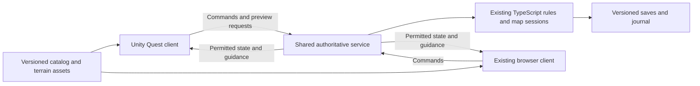

# Quest native versus WebXR: engineering assessment

**Researched: 2026-09-16. Decision: continue with WebXR, accepted by the owner on 2026-09-16.** The owner requested exploration on `codex/fullVR`, with no application building yet, then authorized capturing and merging the findings. This study examines the working tree at baseline `7d6bfbe`, including the existing uncommitted controller-pickup repair. It supersedes the earlier platform comparison where noted; the accepted direction is recorded in the [product requirements](../product-requirements.md).

## Accepted direction

Continue the existing Three.js/TypeScript WebXR application for Quest and browser participants. Do not begin a native migration. IWSDK adoption, installed PWA delivery, offline topology and passthrough versus fully virtual surroundings remain separate choices. The next platform work is headset interaction verification, sustained profiling and a usable delivery path. The native migration inventory and comparison criteria below remain reference material for a future evidence-based reassessment, not scheduled implementation work.

**Audit boundary:** the tests and implementation findings describe the snapshot inspected during this session. Concurrent opponent implementation and live-save changes appeared while the report was being written. They were left untouched and were not evaluated as completed features here; the “remaining work” inventory must be reconciled with that separate work before implementation planning.

## Recommendation

**Keep WebXR for the next playable tabletop milestone. Do not undertake a complete native rewrite on the evidence available today. Keep Unity/OpenXR as the preferred native alternative, and settle the remaining uncertainty with a small, measured comparison before expanding headset-specific features.**

This is a project-specific judgment: browser participation is required, the game is a bounded tabletop for 2–4 players, and working rules, terrain, persistence and both presentation modes already exist. No confirmed requirement currently demonstrates a WebXR capability barrier. The owner’s failed grab/menu trial is real evidence of an interaction problem, but its precise cause has not been established; source inspection found fixable application issues. There is no sustained headset performance measurement supporting either engine choice.

**A native Quest client is a good option, not a bad idea.** I would recommend it if reliable same-table colocation becomes essential and the web path cannot meet it without experimental features; if a required Meta capability has no suitable supported browser API; if representative WebXR performance remains inadequate after a bounded optimization pass; or if a matched native trial shows substantially better interaction reliability at an acceptable maintenance cost. See the [decision criteria](#decision-criteria-and-the-next-experiment).

For native, the recommended architecture is **Unity headset client + existing browser client + common authoritative service**. Rewriting the game authority in Unity is unnecessary for that architecture. Fully offline, headset-hosted play is a larger and separate decision.

Confidence is high in the repository audit and migration boundaries, moderate in the relative engineering tradeoffs, and low in any prediction of this application’s actual Quest frame rate or user comfort. Documentation establishes available mechanisms; device trials establish whether they work well for this game.

## What “fully native” could mean

These are independent goals:

| Goal | What it means for XRiegsspiel |
| --- | --- |
| Fully immersive VR | Surround the player with a virtual environment. WebXR already supports this, and both map renderers request `immersive-vr` today. The application still needs whatever room/environment artwork we choose. |
| An installed app in the Quest library | Launch from an icon instead of navigating to a development URL. Meta supports packaged immersive WebXR PWAs as well as native apps. |
| A native engine client | Compile an Android application using an engine such as Unity with OpenXR; replace the browser rendering/input runtime for headset players. |
| No developer computer or USB cable | Deploy the service on a reachable network and deliver the client appropriately. Both web and native can do this. |
| No internet | Use a local reachable session service, or build offline authority and storage into a client. Installing an APK does not by itself provide either. |
| No external server at all | Run rules, persistence and session authority on a headset or in each isolated offline exercise. This requires additional design and implementation. |

Meta documents immersive PWA packaging and direct immersive launch. The PWA still uses Browser’s rendering engine; it does not become a Unity/OpenXR application or inherit unrestricted native APIs. [N01](#n01), [N02](#n02)

**The present WebXR experience renders on the Quest’s own processor/GPU.** The Mac serves code/assets and processes game commands; it is not streaming rendered VR frames. In `scripts/quest.mjs`, USB forwarding makes the Mac’s local HTTP server reachable as headset `localhost`. The cable requirement belongs to this development launch workflow. A production network/service route is missing, not a PC graphics dependency.

Also, repository references to the “native terrain renderer” mean the original Pacific/CENTCOM renderer. They do not describe a compiled Android client.

## Why we use WebXR now

The reason is documented rather than reconstructed from preference. [The original prototype record](../prototype.md) explicitly says direct Three.js was selected to limit the experiment to terrain, controller rays, a spatial panel and shared commands. IWSDK and Unity remained candidates. Earlier architecture research favored evaluating web delivery because one application could serve both Quest and browser participants.

The implementation then grew from that experiment into the current geographic workspaces. This was a reasonable route to validate the tabletop quickly. It was **not** a measured finding that web outperformed native, an owner-approved permanent engine choice, or adoption of Meta’s complete interaction framework.

### What is actually implemented

| Layer | Observed source | Platform implication |
| --- | --- | --- |
| Rendering and XR entry | `src/pacific/terrain-table.ts`, `src/centcom/view.ts` | Three.js `WebGLRenderer`, WebXR session/pose/controller handling, desktop `OrbitControls`. These require replacement for Unity. |
| Spatial interaction | `src/play/spatial-palette.ts`, `grab-transaction.ts`, `piece-layer.ts` | Custom proximity/ray grip selection, temporary held miniature, validated release, palette movement and cancellation. Behavior is reusable; Three.js event/mesh implementation is not directly portable. |
| UI and client orchestration | `src/play/workspace.ts`, `panel.ts` | Browser DOM controls and canvas-texture spatial UI share actions. This is partly presentation-coupled code, not a ready-made engine-neutral client SDK. |
| Rules and movement | `src/scenario/rules.ts`, `src/pieces.ts` | TypeScript logic runs without WebXR; it can remain on the server. Browser previews also execute it locally. |
| Game authority | `server/scenario-session.ts`, `map-sessions.ts` | One authority/journal per map; rejects stale revisions, validates rules and retries, flushes accepted records before acknowledgment. |
| Transport | `server/main.ts` | JSON command POSTs and server-sent events (SSE) carrying complete map snapshots. No WebXR dependency. |
| Content | `catalog/`, `public/terrain/`, both terrain builders | Catalog identities, sources and geographic inputs can be retained. Native geometry/material creation still needs work. |
| Distribution | `scripts/quest.mjs`, `vite.config.ts` | Local Node service and USB-forwarded Browser launch. No native project, Android packaging, web manifest or service worker was found in this app. |

The installed packages are Three.js **0.186.0**, TypeScript **7.0.2**, Vite **8.3.0**, `@types/three` **0.186.0**, and `@types/node` **22.20.3**. Node **26.0.0** and npm **11.12.1** were observed. **IWSDK is not installed.** Its capabilities must not be attributed to the current app.

Both renderers request only the `local-floor` feature. Neither requests hand tracking, plane detection, anchors or depth sensing. They provide VR and passthrough session entry, manual tabletop placement, controller rays and grip interaction. Bare-hand grabbing, physical table discovery and persistent room alignment remain unimplemented.

The inspected local interaction repair corrects ray-only targeting, stale world transforms, handle placement and feedback. The owner’s latest physical retest remains pending. The 60 passing tests include event/raycast tests, but none substitute for operating the controllers on a worn headset. That repair is separate uncommitted work and is not included in this documentation merge. The [published terrain runbook](../playable-terrain.md) records the earlier implementation and hands-on checklist.

## Capability and tradeoff comparison

“Available” below describes documented platform capability, not verification of XRiegsspiel on the device.

| Need | WebXR / packaged WebXR | Native Unity/OpenXR | Consequence for this project |
| --- | --- | --- | --- |
| VR and passthrough tabletop | Both session modes available. | Both available through appropriate XR/Meta configuration. | Neither mode forces an engine change. [N02](#n02), [N03](#n03), [N13](#n13) |
| Controllers, direct/distant grab | Input API supplies select/squeeze/poses; interaction design belongs to the app or a framework. | Meta Interaction SDK supplies grab, ray, poke and distance-grab components. | Native reduces some custom interaction infrastructure; it does not automatically solve target sizing, reach or accidental orders. [N04](#n04), [N12](#n12) |
| Hands | Browser exposes hand joints; IWSDK includes interaction systems. | Meta recommends Interaction SDK for standardized hand interactions. | Our missing hand interaction is an implementation gap. Native is not necessary merely to add hands. [N05](#n05), [N06](#n06), [N14](#n14) |
| Spatial menus and text | Custom meshes/canvas UI today; IWSDK spatial UI and WebXR layers are options. Browser also documents a system keyboard with limitations. | Engine UI, interaction components and composition layers. | Current dense menus and custom keyboard are design choices, not the limit of WebXR. Test text clarity and keyboard lifecycle on either path. [N06](#n06), [N07](#n07), [N08](#n08), [N15](#n15) |
| Table/room placement | Browser documents planes and anchors; current IWSDK documents depth occlusion where the device grants the feature. | MRUK offers scene queries, depth-assisted placement and room utilities. | Native has a more integrated Meta-specific workflow. Keep manual placement when room data is unavailable. [N03](#n03), [N09](#n09), [N13](#n13) |
| Same physical table across headsets | A primary prototype documents experimental shared reference spaces. Stable support on the installed Browser was not established. | Documented shared-anchor, discovery and world-alignment workflows. | A strong reason to evaluate native if colocation is essential; shared game state alone never aligns physical space. [N10](#n10), [N16](#n16) |
| Raw camera / computer vision | Current IWSDK documents MediaDevices camera streams. Exact Quest camera selection, calibration and permission behavior were not tested. | Documented PCA access including intrinsics/extrinsics and timestamps. | Do not claim camera access is categorically native-only, or assume the APIs are equivalent. Neither is needed for digital pieces on passthrough. [N11](#n11), [N17](#n17) |
| Performance controls | Foveation, multiview, layers and frame-rate control are documented. Browser scheduling/runtime and exposed extensions constrain integration. | Broader engine/rendering and Meta extension control; native profiling and asset pipelines. | Native offers more control, not an automatic speed multiplier. Measure identical content at comparable visual quality. [N07](#n07), [N18](#n18), [N19](#n19) |
| Browser play | Existing application and shared TypeScript preview behavior. | Keep a separate browser client and a shared service. | Native adds a second presentation implementation. Unity does not directly support WebXR export; third-party exporters add another compatibility boundary. [N15](#n15) |
| Install and update | URL delivery, optionally signed immersive PWA packaging. Web assets can update independently of the wrapper. | Signed APK and native release/update pipeline. | PWA is a credible route if the main concern is launch friction. Both need version compatibility with the service. [N01](#n01), [N20](#n20), [N21](#n21) |
| Offline use | Requires deliberate asset caching and local game authority or LAN service. | Bundling assets is straightforward, but game authority/storage must still exist. | The present server dependency survives a client port unless deliberately changed. |
| AI, analytics and adjudication | Can execute in a service independently of rendering. | Can use that same service. | These product ambitions do not by themselves justify native headset rendering. |

### The strongest reasons to continue with WebXR

One client already implements the geographic board and both input paths. Rules can remain shared between browser previews and the TypeScript authority. URL delivery makes short classroom trials and iteration simpler. Existing maps, geometry and UI need less reimplementation, leaving more effort for the actual planning/adjudication experience.

Meta continues to document a substantive web development path: IWSDK combines Three.js with grabbing, XR lifecycle, spatial UI, scene systems and desktop emulation. These are potential tools if our custom interaction code becomes costly. Adopting IWSDK would itself be an integration project; it is not a package install that automatically converts the current application. [N06](#n06)

### The strongest limitations of continuing with WebXR

We must ship within Browser’s available APIs and runtime behavior, including permission, focus, suspension, storage and optional-feature differences. Web application dependencies can be pinned; the installed Browser is a separate moving dependency. An API in a draft or experiment is not an acceptable unattended-classroom dependency without evidence and fallback behavior.

The current app also performs UI updates, rule previews, serialization and rendering-related work in the browser. Large maps, many selectable miniatures, canvas text redraws or long journals may create hitches; no profile has identified the dominant cost yet. Workers, bounded updates, asset loading and rendering changes are options to investigate after measurement. Unity also has main-thread work, memory management and lifecycle risks.

We currently own much of the interaction infrastructure ourselves. Continuing indefinitely with bespoke grabbing, panels and input recovery can consume the delivery advantage that motivated web in the first place. If a supported framework or native toolkit materially improves reliability, that is engineering evidence worth acting on.

### The strongest reasons to choose native

Unity with OpenXR and selected Meta SDKs provides integrated scene authoring, interaction components, native device APIs and an installed app lifecycle. MRUK/shared-anchor workflows particularly suit a future product centered on several headsets collaborating around one physical board. Native also makes an app-bundled content baseline and application-owned local storage a natural delivery model. [N12](#n12), [N13](#n13), [N15](#n15), [N16](#n16)

Its cost is a new headset renderer/input/UI implementation, cross-client behavior testing, Android builds and signed releases. Existing procedural Three.js miniatures and canvas controls cannot simply be opened in Unity. Browser participation still needs maintenance. Engine licensing eligibility also needs checking against the actual organization and product classification; an educational training purpose does not establish a particular free Unity entitlement. No license cost or classification is assumed here. [N22](#n22)

## What a native migration would retain and replace

Proposed architecture:

“Permitted state” is a future requirement for opposing roles. Today the service sends full shared state deliberately. This diagram is not a claim that authorization or a preview endpoint already exists.

| Retain | Adapt or expose | Rebuild for native |
| --- | --- | --- |
| Catalog IDs, provenance, eligibility data and authored movement profiles | Explicit versioned JSON contract usable from C# | Quest scene, camera rig, lights, materials and board controls |
| Six map identities, source geography and saved exercises | Original terrain presentation exported/baked or recreated and checked | Mesh loading/generation, labels, highlights and controller picking |
| Existing server-side rules, durable journal and replay checks | Client-independent action guidance/preview API | Native catalog/menu/search UI and miniature presentation |
| Command semantics and stale/duplicate protections | C# serialization, transport, reconnect and revision handling | Grab/drop feedback, focus/tracking loss handling and UI lifecycle |
| Original miniature designs | A portable asset pipeline, for example verified glTF export, or equivalent engine assets | Native model/material setup and thumbnails |
| Authored scenario library and design research | Future live scenario/adjudication integration | Packaging, signing and native device verification |

The preserve-terrain requirement includes coastlines, reef/lagoon distinctions, source classifications, labels and illustrative relief. Carrying over only the movement-policy grid would repeat the earlier fidelity loss. Keep tile IDs and source terrain separate from movement categories. Coordinate conversion also needs a deliberate Three.js-to-Unity axis/handedness convention, units, winding, north direction and origin fixtures.

### The most consequential missing interface

The current browser computes legal destinations and previews by directly calling `GeographicRules`. The server exposes only state, events and committed commands. A Unity client cannot reuse TypeScript functions as ordinary C# code.

**Recommended first native approach:** expose server-calculated eligibility, legal destinations, route/cost and action explanations keyed to map/revision. Keep immediate hand movement and a local held-piece visual independent of the network. Refresh guidance on selection/revision changes; revalidate when releasing a piece. Do not round-trip every controller frame. On loss of connection, cancel the draft or show a pending state without inventing an accepted move.

This preserves one rule authority and avoids maintaining two adjudication implementations. Its costs are a new endpoint/contract and measured network latency. A local C# rules port or portable shared runtime becomes a separate option if offline authority or latency requirements demand it. Any such port needs common test vectors for paths, budgets, cargo identity, versions and replay—not just similarly named methods.

The current protocol uses `{ id, revision, operation }`, not the richer proposed actor/role envelope in earlier research. Native retry handling must preserve the original ID and identical command representation: the server compares serialized request objects for duplicate identity. A revised cross-language contract should specify canonical field semantics rather than silently depending on JavaScript property ordering. Saves also perform strict version/manifest comparisons. Preserve existing journals and verify old saves during any contract change.

SSE is HTTP and can be consumed by a native client using a streaming transport implementation. WebSockets or a commercial multiplayer service are not intrinsically necessary for this turn-based command flow. Snapshot size, reconnect/backoff, mobile suspension and error handling still need testing. More frequent remote hand/pointer/avatar poses, if later wanted, should remain presentation traffic rather than replacing validated game commands.

## Native work remaining, in dependency order

These are proposed future tasks. None were implemented during this research.

| Stage | Concrete work | Completion evidence | Relative scope |
| --- | --- | --- | --- |
| 1. Reproducible native foundation | Create an XRiegsspiel Unity project, pin compatible editor/packages, Android ARM64/IL2CPP, URP/OpenXR, input rig, app identity and build configuration. Use only needed Meta packages. | A fresh build installs and launches on Quest, with controller poses and a readable test board. | Medium; toolchain exists, clean build unproven. |
| 2. One-map presentation | Preserve one existing map’s geometry/appearance and stable tile IDs; display the same class miniatures and adjustable seated table. | Native and browser agree on geography, coordinates and identities; physical readability/reach trial. | Medium–high; source assets are reusable, renderer is new. |
| 3. Shared service client | Define/validate DTOs, add preview/guidance surface, implement snapshot/command/SSE transport and cancellation. | One native placement/move/cargo flow appears once in a browser and survives retry, stale state and reconnect. | Medium–high. |
| 4. Full current feature parity | Catalog search/force/era filtering; palette move/hide; all six maps; cargo, turns, per-map reset/save restore; continuous in-app navigation. | Existing map exercises survive; all current authorized operations work through both interfaces. | High; most UI work is here. |
| 5. Selected MR capability | Add passthrough, placement assistance or persistent/shared anchors only where required; retain manual/controller fallback. | Same-room alignment and permission-denied/relocalization tests if those features are selected. | Conditional, potentially high. |
| 6. Delivery and sustained use | Service discovery/join flow, chosen hosting/LAN route, signing, repeatable release build, distribution channel, update compatibility, pause/resume and on-device profiling. | Another person launches and completes the intended session without a developer laptop or manual recovery. | Medium–high, dependent on deployment needs. |

The local reference remains useful: Unity **6000.4.5f1** and its Android support directories exist; the sibling project records URP **17.4.0**, OpenXR **1.15.1**, Unity Meta OpenXR **2.4.0**, and Meta Core/MRUK **201.0.0**. These are observed reference versions, not a new supported-version matrix or latest-version prescription. Its TextMesh Pro manifest/lock discrepancy is recorded in the [prior audit](prior-project-audit.md). The [computer audit](computer-readiness.md) contains earlier successful compiler/tool checks; this session rechecked package records and module presence, not those compilers or a Unity build. [N23](#n23), [N24](#n24)

A clean XRiegsspiel native project should carry forward setup knowledge, not the sibling’s automatic camera/YOLO bootstrap, permissions, network endpoints, branding or app identity. There is no reason to introduce camera recognition for digital board pieces.

A prototype APK can be sideloaded during development. External testing and production distribution need their corresponding packaging and channel setup. Meta’s release-channel documentation distinguishes test distribution from production review; even alpha uploads have packaging requirements. [N21](#n21)

No credible calendar estimate follows from source inspection alone. Stages 1–3 provide the information needed to estimate the rest. Treating the port as “export our website as APK” would seriously understate it.

## Work that remains if we stay with WebXR

1. **Finish the headset interaction evidence.** Repeat the repaired grip/menu trial; verify both hands/controllers, near and distant targets, cancel, high/invalid drops, focus loss, seated reach and both terrain workspaces. Distinguish received squeeze events from targeting failures using the existing diagnostics.
2. **Profile a representative load.** Use the actual six maps and representative roster sizes, with labels, highlights, catalog browsing and a second participant. Measure hitches while selecting, updating state and switching maps, not only an empty static board. Improve the measured bottleneck.
3. **Provide a real delivery path.** Host the client and authority at reachable addresses, establish HTTPS for ordinary headset web access, and add a join/reconnect flow. The current POST origin check compares against literal `http://` and the server defaults to loopback. A reverse proxy/TLS deployment therefore needs intentional origin/proxy configuration and testing. This is also service work for a native client.
4. **Choose URL or installed delivery.** If an icon/direct launch is wanted, add a web manifest, immersive launch lifecycle and a signed Quest PWA package with verified Digital Asset Links. The current app has none of this packaging. [N01](#n01), [N02](#n02), [N20](#n20)
5. **Define offline behavior explicitly.** Cached assets alone cannot replace the current authoritative Node process. A LAN exercise may avoid internet during play while still needing a local service and trusted HTTPS setup. A truly isolated headset exercise needs local authority, durable saves, migration and reconciliation behavior. Neither path has been tested here.
6. **Reduce custom XR maintenance where justified.** Trial one IWSDK interaction/UI slice against the current code before adopting its ECS/runtime throughout. Avoid coupling game rules to either framework’s scene objects. Add hands, anchors or depth only when a selected user experience needs them.

A useful rendering detail: the installed Three.js `WebXRManager` defaults its foveation value to **1.0** and applies it during session setup when supported. It also contains a projection-layer path. Consequently, “turn on foveation/layers” is not a demonstrated missing optimization. Our canvas menu is still an ordinary scene mesh; separate compositor UI layers and actual multiview use need independent investigation. Strong foveation can also hurt peripheral text. Inspect the live configuration before changing it. [N07](#n07), [N18](#n18)

## What neither engine choice finishes

The app is currently a shared, full-information map/catalog/movement/transport workspace. Becoming a complete training wargame also requires the following product work on either renderer:

| Gap | Current evidence and remaining work |
| --- | --- |
| Live scenario loop and victory | Eight scenarios and an offline scorer exist; integrate the selected scenario’s phases, conditions, outcomes and calibrated rules into live sessions. |
| Opposition and authority | Current clients share control; there are no authenticated actor/role permissions or role-filtered observations. These are needed for the proposed opposed experience, not silently part of current cooperative play. |
| Adjudication and referee controls | Movement/cargo validation exists. Combat/detection or other scenario-specific interactions, contest handling and explained referee rulings remain separate work. |
| Learning records and review | Replay-validating saves exist. Historical player knowledge, richer decision capture, analysis and after-action teaching workflows remain design proposals. |
| AI opponent and AI Sensei | Research/headless probes exist; a competitive opponent and evaluated teaching system do not. Neither requires Unity rendering. |
| Production operation | Multiple exercise groups, access control, deployment, recoverability, compatibility and session-length testing remain beyond the local prototype. |
| Content quality | The 18 miniature classes are stylized, not accurate representations of all 1,607 catalog variants. Engine migration does not supply accurate art or validated real-world performance data. |

These are references to existing [requirements](../product-requirements.md), [playable-terrain evidence](../playable-terrain.md), [scenario status](../scenarios/README.md) and [data-capture proposal](../design/data-capture.md), not new rules or an expanded implementation mandate.

## Other native options considered

| Option | Assessment for this repository |
| --- | --- |
| **Unity + OpenXR + selected Meta SDKs** | Preferred native candidate because we already have local toolchain/setup knowledge and Meta supplies relevant interaction/MR workflows. The case is project fit, not a claim of universal engine superiority. |
| **Godot + OpenXR/vendor extensions** | Credible open-source native option; official documentation describes Android XR deployment and vendor extensions. No existing Godot project/toolchain was established here. Consider if engine licensing/control becomes decisive. It still requires a headset-client port. [N25](#n25) |
| **Unreal + OpenXR/Meta integration** | Supported Quest development path, but this repository has no Unreal foundation. There is no demonstrated benefit for the current restrained tabletop that offsets a different engine/toolchain port. Revisit for a materially richer environment or an experienced Unreal team. [N26](#n26) |
| **Meta Spatial SDK / Kotlin** | A genuine native alternative for immersive Android apps, with 3D assets, scene APIs and panels. Attractive for an Android-centered product/team; it would still replace our TypeScript/Three.js presentation. [N27](#n27) |
| **Custom C++ OpenXR client** | Maximum low-level ownership, with much more renderer/input/tooling work. No current requirement justifies owning that infrastructure. [N26](#n26) |
| **Generic website wrapper or third-party exporter/runtime** | An APK extension alone proves nothing about immersive support or native execution. Meta’s documented immersive PWA route is the practical web packaging candidate. A different runtime/exporter needs its own maintenance, device and extension-compatibility evidence. |

## Decision criteria and the next experiment

**Research recommendation only; no spike was built.** First perform the existing physical Quest checklist. If native remains under consideration, compare one current map, the same miniature set and the same command sequence in a minimal Unity client against the repaired web client. Include native-to-browser play in the comparison. Avoid porting all six maps or rewriting rules just to answer the engine question.

Proposed evaluation contract:

| Question | Evidence to collect |
| --- | --- |
| Does interaction work reliably? | Repeated near/ray grabs, menu moves, releases and cancels with each controller; record misses, assistance and accidental commands. Proposed initial sample: 20 valid attempts per interaction/controller, plus deliberate invalid cases. This is a screening trial, not a statistical reliability claim. |
| Is it comfortable and readable? | Actual users select named variants, read costs and operate the palette seated; check both virtual and passthrough backgrounds where selected. Record reach/readability problems rather than assuming visual polish means usability. |
| Does rendering sustain the chosen rate? | Start with a proposed 72 Hz target (13.89 ms frame interval), then evaluate 90 Hz (11.11 ms). Record actual requested/supported rate, app CPU/GPU timing where available, dropped frames, memory and thermals for at least 20 minutes or the intended session length if longer. Do not equate compositor refresh with application throughput. [N18](#n18), [N19](#n19) |
| Does load change the answer? | Compare small and representative rosters and the current 200-piece application limit, including the largest maps, labels and routes. Match visible quality; record startup and map-switch stalls separately. |
| Does state remain correct? | Headset/browser convergence, exactly-once retries, stale rejection, disconnect/rejoin, headset removal and all-map save preservation. No unacknowledged gesture may be treated as committed. |
| Does delivery work without the developer? | Cold launch, session join, service unavailable, restart/update and the intended venue network. Test installed packaging if launch friction is the concern. |
| Is shared-table alignment required? | If yes, test two physical headsets, relocalization and reentry at the same table. A one-headset test or API sample cannot answer this. |

Choose WebXR if it meets the selected experience, sustained performance and delivery requirements. Make **one bounded pass on measured web bottlenecks**, then compare again; do not enter an indefinite optimization project.

Choose native if a necessary supported API is absent from the web path, a representative optimized web trial misses the required frame/interaction target while the native trial meets it, or native demonstrably saves enough ongoing XR integration work to justify maintaining two clients. For same-table colocation, lack of proven stable web support is sufficient reason to prioritize the native trial; it is not proof that all web multiplayer is deficient.

A poor native result would also be evidence: investigate asset/UI/rules-update design shared by both trials before attributing every failure to the engine. The same Quest hardware, content and user workflow should drive the decision.

## Verification performed for this research

- Read repository instructions, requirements, platform/architecture/prototype research, the active terrain runbook, current implementation, package manifests and relevant Git history. Rechecked the sibling native manifest/editor record without changing that project.
- Retrieved primary Meta, Unity, W3C and Godot references below. They cover framework capabilities and release workflows; they are not app benchmarks. Third-party anecdotes and search-result summaries were not used as performance evidence.
- `npm ls --depth=0` confirmed installed dependency versions. `npm test` passed **60/60** tests. `npm run typecheck` passed.
- Read-only ADB inventory confirmed one authorized **Quest 3**. Android reports **14**, build incremental **52433670036000520**. The installed Browser update is **150.1.0.24.52.1046134268**; **149.1.0.10.52.1018773393** is the hidden factory package, not the active update. The firmware identifier was not translated into an assumed marketing OS version.
- ADB initially could not start its listener inside the sandbox; the permitted read-only retry succeeded. No app was installed, launched, stopped or reconfigured, and no camera/room data was collected.
- A comparison of 76 recorded application, asset, dependency and save-file hashes found concurrent changes to `src/opponent/content.ts` and the Palawan/Spratlys journal; new opponent files also appeared. This task made no application/save changes and did not revert that other work. The 60-test result is the audited baseline result, not certification of subsequently arriving code.
- Eight research/navigation documents passed a check of 229 relative links/anchors, balanced fences, final newlines and whitespace. `git diff --check` passed. These checks validate document structure, not every external URL's availability; actual source retrieval is described below.

No new application build, package installation, native conversion, immersive-session trial, physical controller test, performance trace or public deployment occurred. Existing uncommitted repairs are outside this research change. The remaining material risk is choosing a delivery/runtime path before representative headset and network evidence exists.

## Sources and retrieval scope

All accessed **2026-09-16**. Page dates below are publisher update dates where available, not crawl dates. Section names identify the material consulted. Older examples and experimental proposals are explicitly qualified. Local source paths above refer to the inspected working tree, not a separately published release.

### N01

[Meta: Progressive Web Apps](https://developers.meta.com/horizon/documentation/web/pwa-overview/) — updated 2026-07-22; **Overview**, **How PWA packaging works**. Hosted web/PWA distribution, immersive versus 2D app mode, Bubblewrap/Trusted Web Activity.

### N02

[Meta: Getting Started with WebXR PWAs](https://developers.meta.com/horizon/documentation/web/pwa-webxr/) — updated 2026-07-22; **Overview**, **Request a WebXR session after page load**, **Frequently Asked Questions**. Same Browser engine, direct immersion and app-icon user activation. This newer route is preferred over the older `/pwa-webxr-gs/` page also retrieved.

### N03

[Meta: Mixed Reality Support in Browser](https://developers.meta.com/horizon/documentation/web/webxr-mixed-reality/) — **Passthrough Mode**, **Plane Detection**, **Persistent Anchors**. Retains historical Quest 2/Pro examples. Its old camera-pixel statement must not be generalized to current separate camera-stream APIs; quotas/device details were not treated as fresh tests.

### N04

[W3C: WebXR Device API](https://www.w3.org/TR/webxr/) — **Session**, **Input**, **Primary squeeze action**, session feature/security definitions. API specification, not a device compatibility table.

### N05

[Meta: WebXR Hands](https://developers.meta.com/horizon/documentation/web/webxr-hands/) — hand joints, input sources, reserved gestures and implementation examples. Documentation establishes hand-input support, not this application’s gesture quality.

### N06

[Meta: Immersive Web SDK](https://developers.meta.com/horizon/documentation/iwsdk/guides/overview/) — updated 2026-09-04; **Core capabilities**, **Development and testing**, project/runtime organization. [Official repository](https://github.com/facebook/immersive-web-sdk), README, also retrieved. No dependency installed or framework migration attempted.

### N07

[Meta: WebXR Layers](https://developers.meta.com/horizon/documentation/web/webxr-layers/) — compositor/timewarp layer description and integration guidance. Availability does not establish use of separate UI layers in our renderer.

### N08

[Meta: System Keyboard in WebXR](https://developers.meta.com/horizon/documentation/web/webxr-keyboard/) — **Requirements**, **Limitations**, **Checking for System Keyboard Support**, **Lifecycle**. Feature detection and editing/visibility constraints; no fresh keyboard test.

### N09

[Meta: IWSDK Chapter 15, Depth Occlusion](https://developers.meta.com/horizon/documentation/iwsdk/guides/15-depth-occlusion/) — updated 2026-09-04; depth feature request, material integration and troubleshooting. Device/browser must grant the feature; not a blanket support guarantee.

### N10

[Rik Cabanier: shared-spaces prototype](https://github.com/cabanier/shared-spaces) — README **Introducing shared spaces**, **Properties**, **Additions to the WebXR spec**. Primary experimental implementation/proposal describing a Browser v39 flag. Current default/stable availability was not established. This is distinct from Meta’s native Unity SharedSpaces networking sample.

### N11

[Meta: IWSDK Chapter 13, Camera Access](https://developers.meta.com/horizon/documentation/iwsdk/guides/13-camera-access/) — updated 2026-09-04; **Enumerate cameras**, source configuration, MediaDevices permission/lifecycle. Generic camera streams do not establish parity with native calibration/metadata access.

### N12

[Meta: Building Blocks Overview](https://developers.meta.com/horizon/documentation/unity/unity-building-blocks-overview/) — updated 2026-09-08; interaction rig, grab, distance grab, haptics and placement entries. [Distance Grab Interactions](https://developers.meta.com/horizon/documentation/unity/unity-isdk-distance-grab-interaction-overview/) — updated 2025-08-07; hand/controller interaction options. Components still require application integration and testing.

### N13

[Meta: MR Utility Kit overview](https://developers.meta.com/horizon/documentation/unity/unity-mr-utility-kit-overview/) — updated 2026-03-02; **Key Areas**, **Place Content without Scene**, **Place Content with Scene**, **World Lock Colocation**. Native spatial workflows, not browser parity.

### N14

[Meta: Hand Tracking Overview for Unity](https://developers.meta.com/horizon/documentation/unity/unity-handtracking-overview/) — updated 2026-09-14; **Hand Tracking**, **Notices**. Recommends Interaction SDK and retains controllers for precision-sensitive use.

### N15

[Unity 6.4: XR packages](https://docs.unity3d.com/6000.4/Documentation/Manual/xr-support-packages.html) — **XR plug-ins**, **Notes**, **XR support packages**. OpenXR/Meta extension distinction, interaction/composition packages and explicit lack of direct Unity WebXR support.

### N16

[Meta: Unity Shared Spatial Anchors sample](https://developers.meta.com/horizon/documentation/unity/unity-sample-shared-spatial-anchors/) — **What you will learn**, **Requirements**, **Get started**. User/group sharing, Bluetooth colocation discovery and coordinate alignment; sample-specific networking is not a mandate to replace our game service.

### N17

[Meta: Getting Started with Passthrough Camera API in Unity](https://developers.meta.com/horizon/documentation/unity/unity-pca-documentation/) — updated 2025-12-09; overview and `PassthroughCameraAccess` metadata/texture methods. Camera access is separate from displaying passthrough.

### N18

[Meta: WebXR performance optimization](https://developers.meta.com/horizon/documentation/web/webxr-perf/) — updated 2026-07-21; profiling/rendering index. Followed [performance tools](https://developers.meta.com/horizon/documentation/web/webxr-perf-tools/), [fixed foveation](https://developers.meta.com/horizon/documentation/web/webxr-ffr/), [multiview](https://developers.meta.com/horizon/documentation/web/web-multiview/) and [frame-rate control](https://developers.meta.com/horizon/documentation/web/webxr-frames/). Tools and mechanisms, not measured gains.

### N19

[Meta: Testing and performance analysis](https://developers.meta.com/horizon/documentation/unity/unity-perf/) — updated 2024-10-30; **Performance targets**, **Draw Calls**. [OVR Metrics best practices](https://developers.meta.com/horizon/documentation/unity/ts-ovr-best-practices/) — FPS, frame budgets and diagnostic overhead. Native submission guidance is not asserted to be web certification; 72 Hz is our proposed comparison target.

### N20

[Meta: Package a PWA for Meta Quest](https://developers.meta.com/horizon/documentation/web/pwa-packaging/) — **Configure signing**, **Digital Asset Links**, **Build**, **Sideload**, **Troubleshooting**. An immersive package needs successful origin/package verification. Packaging instructions were researched, not executed.

### N21

[Meta: Release Channels](https://developers.meta.com/horizon/resources/publish-release-channels/) — updated 2026-03-23; **Alpha, Beta, Release Candidate**, **Production channel and app review**. [Lifecycle of a VR app](https://developers.meta.com/horizon/resources/publish-app-review/) — pre-review readiness and technical requirements. No store/account/channel actions taken.

### N22

[Unity Industry](https://unity.com/products/unity-industry) — FAQ **How do I know Unity Industry is the right solution**, **Can industry customers still buy Unity Pro or Unity Enterprise**, **Distributing the runtime for commercial purposes**. Shows that product/organization classification affects terms. No determination of this owner’s eligibility or price was made.

### N23

[Meta: Unity hardware and software requirements](https://developers.meta.com/horizon/documentation/unity/unity-development-requirements/) — updated 2026-08-11; **Unity**, **System requirements** and Apple Silicon note. The older macOS wording remains inconsistent; the existing host audit and a future clean standalone build are stronger project evidence than assuming a Windows Link workflow.

### N24

[Unity 6.4: Supported Android dependency versions](https://docs.unity3d.com/6000.4/Documentation/Manual/android-supported-dependency-versions.html) — **SDK**, **NDK**, **JDK**, CMake note. Reference for version-matched tool selection, not a package-upgrade recommendation.

### N25

[Godot OpenXR Vendors documentation](https://godotvr.github.io/godot_openxr_vendors/index.html) — vendor extensions and Android loaders. [Godot 4.7 XR next steps](https://docs.godotengine.org/en/4.7/tutorials/xr/xr_next_steps.html) — vendor plugin and interaction toolkits. Older Android deployment documentation was also consulted but its version-specific configuration was not adopted.

### N26

[Meta: Platforms](https://developers.meta.com/horizon/discover/platforms/) and [Quick start](https://developers.meta.com/horizon/essentials/quick-start/) — engine, web, Spatial SDK and low-level OpenXR development paths. Broad path selection, not an exact current engine/package compatibility matrix.

### N27

[Meta: Spatial SDK overview](https://developers.meta.com/horizon/documentation/spatial-sdk/spatial-sdk-explainer/) — updated 2025-05-08; Kotlin/Android basis, MR, graphics, scenes and panels. No Spatial SDK project or performance evaluation was performed.
